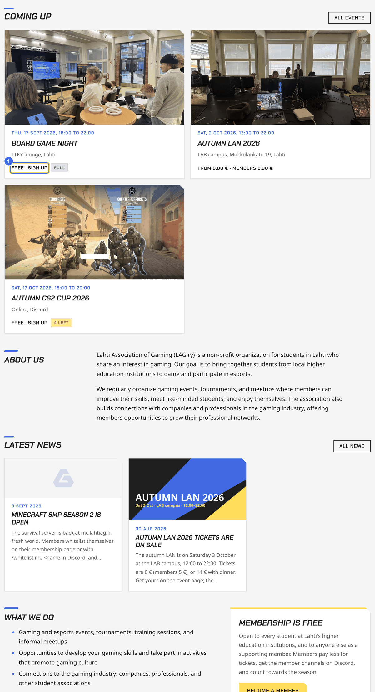
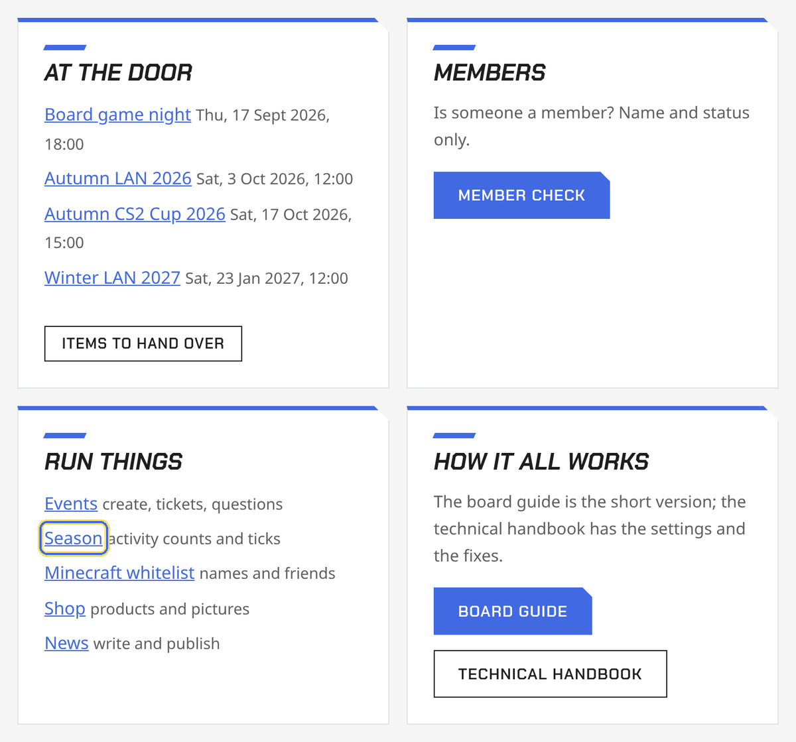
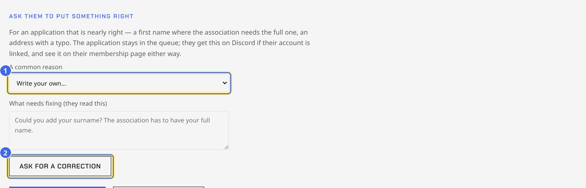
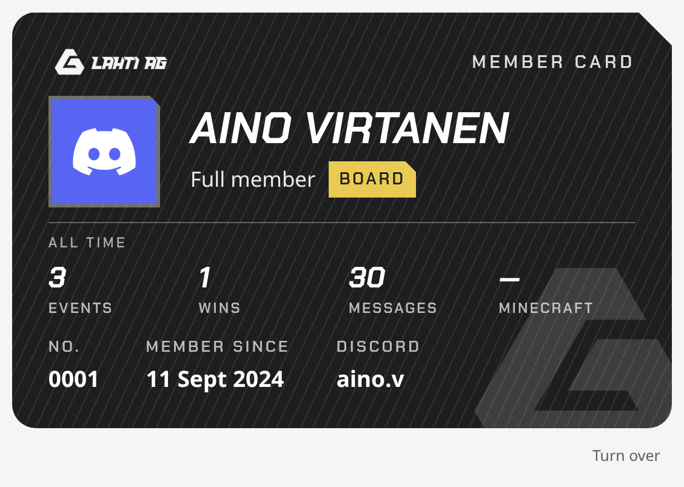
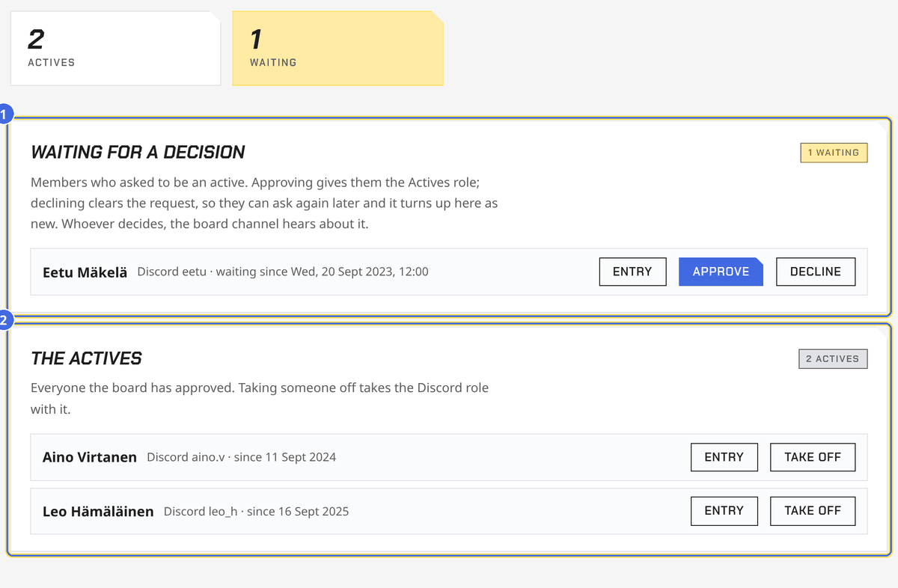
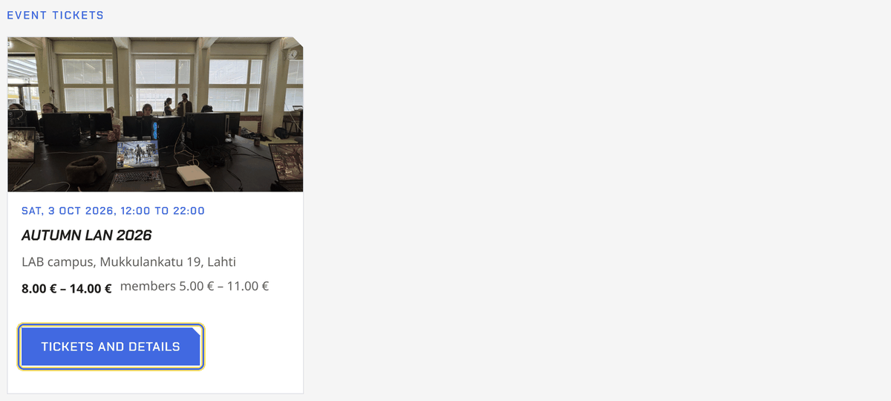
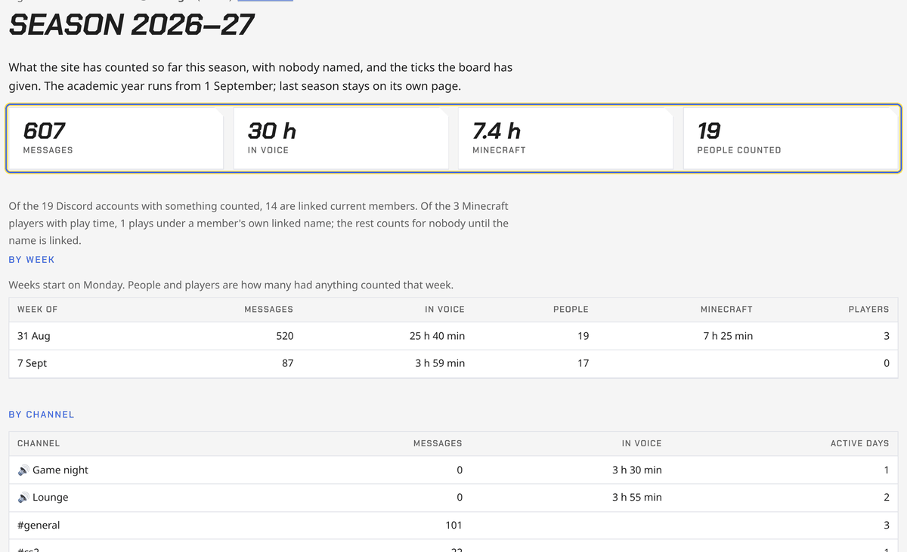
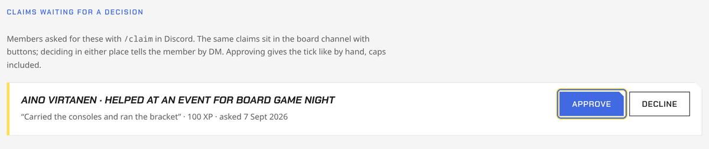
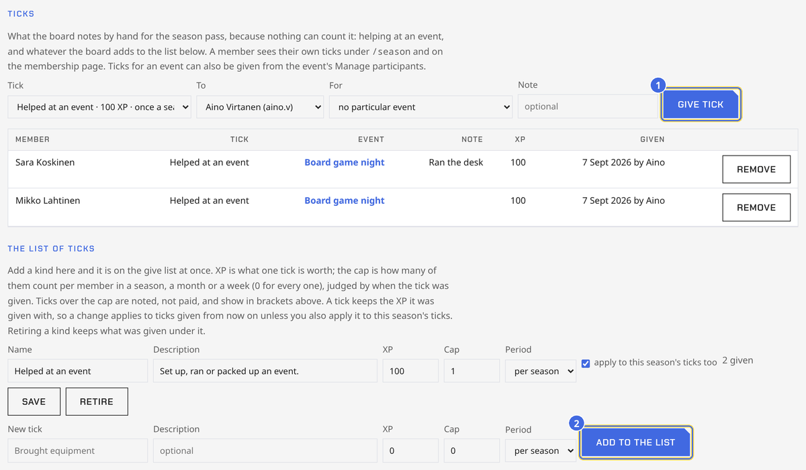
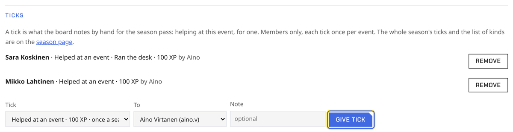

# Board guide to lahtiag.fi

The short version: what the site does for the board, where each thing is,
and what happens behind the scenes. The [technical handbook](/handbook/technical)
has the details, the settings and the fixes.

## Contents

- [The front page](#the-front-page)
- [Signing in](#signing-in)
- [Who can do what](#who-can-do-what)
- [Members](#members)
- [Events](#events)
- [Tickets and the shop](#tickets-and-the-shop)
- [At the door](#at-the-door)
- [Money](#money)
- [News](#news)
- [Minecraft server](#minecraft-server)
- [Where things are](#where-things-are)

## The front page

lahtiag.fi opens with the hero and the Discord widget, then alternates
what is happening with what the association is: **Coming up** (the next
three events with their covers, what a seat costs and how much room is
left), **About us**, **Latest news** (the three newest posts), **What we
do** with the membership box beside it, and **From our events** (a picture
from each event that has an album). The events, news and photos are not
written by hand: publish an event, post news or upload photos and the front
page follows. The words are `src/content/pages/home.md`, split where its
headings are — edit that file and both halves follow.

*Under the hero: 1 what a seat costs and how much room is left, 2 a picture from each event with an album. Everything links on: All events, All news, the whole history.*

## Signing in

There are two logins.

- **Discord.** Everyone signs in with Discord, top right of every page. A
  board member's account carries the Board role on our server, and that
  unlocks the board tools: creating events, the door, the shop, news.
- **Register login.** The member register holds personal data, so it
  opens only for the chair, the treasurer and whoever they add, through
  the lahtiag.fi Google account. It lasts eight hours. The link is
  "Board login" at the bottom of every page.

| | |
|---|---|
|  |  |
| Sign in with Discord, top right of every page. | The bottom of every page: 1 Board login opens the register, 2 Handbook is this guide. |

*Signed in with the Board role: the strip on the events and news pages links to the member check.*

## Who can do what

| | Any member | Board role | Register access |
|---|---|---|---|
| Sign up, buy tickets, manage own membership | yes | yes | yes |
| Create and publish events, sell tickets, run the door, shop, news | | yes | yes |
| Check whether someone is a member (name and status) | | yes | yes |
| See the actives and decide who becomes one | | yes | yes |
| Open the full register, approve members, export | | | yes |

*lahtiag.fi/board: every board page one click away. 1 card payments waiting to be attached, 2 the season page. Actives requests waiting for a decision show the same way, under Members. Board login shows the same to a board member without register access.*

Board tools sit at the bottom of a page in a folded "Board tools" block,
so nothing sensitive shows when a page is on a projector. A small pill at
the bottom right lets you view a page as a member or a visitor would.

*Board tools stay folded at the bottom of the page until you click them.*

*The pill at the bottom right shows the page as a member or a visitor would see it.*

## Members

- **Joining.** People apply at lahtiag.fi/join, ideally signed in with
  Discord so their account is linked from the start. The board's private
  Discord channel gets a note; the application waits in the register.

*lahtiag.fi/join: the application form. Signing in first links the Discord account from the start.*

- **Approving.** On the register page, applications are at the top with
  Approve and Reject. Approving gives the Member role on Discord (and
  Actives, if approved as an active) and posts a welcome in the general
  channel. The register shows a hint if the person may already be in it,
  with the reason, and a Merge button. If they ticked the actives box on
  the form, approving the membership sends that request to the board
  channel and the Actives page — it is a second decision, and the whole
  board makes it.

- **An application that is nearly right.** Somebody applies as "Nina"
  when the association has to record a full name, or mistypes their
  address. On the entry's own page, under the application, there is *Ask
  them to put something right*: pick one of the common reasons — full
  name, home municipality, email, Discord handle, where you study, each
  with the reason the association has to ask — or write your own, and
  send it. They get it as a Discord message when their account is linked,
  and either way it sits on their own membership page above the form that
  answers it. If Discord will not take the message — they have left the
  server, or keep their DMs shut — it goes to them by email instead, and
  the board channel says so. The application stays in the queue, marked *waiting on
  them*, and the note clears itself the moment they save their details.
  Nobody is rejected for a typo, and nobody on the board has to guess at
  a surname.

- **An applicant without Discord** has no membership page to fix
  anything on, so the correction goes to them by email from the
  association's own address and carries a **private link**: it opens
  their own entry, shows what you asked, and takes the answer straight
  into the register. It works for a fortnight, dies when the application
  is decided or the question is withdrawn, and asking again sends a new
  one and stops the old working. They can also simply reply, and you type
  the answer in yourself. If the sending address is not
  set up (OPERATIONS, "Email from the association's own address"), the
  panel says plainly that nothing was sent and leaves the writing to
  you.
  Saving the note still marks the application *waiting on them* so the
  queue remembers where it stands. If they later sign in with Discord and
  claim the entry with that same email (the join page), the page becomes
  theirs and they keep it current themselves.

*Under the application on its own page: 1 a common reason fills the box — edit it, it is your words that go — then 2 send it. The application keeps its place in the queue.*

*The register's toolbar: 1 Add entry, 2 Venue lookup (the member check), 3 Access, 4 Export CSV. The tiles count members, pending applications, actives and former members.*

*Applications at the top of the register: 1 Approve or Reject; 2 the yellow hint when the person may already be in the register, with Merge into this entry.*

| | |
|---|---|
|  |  |
| A member who signed in with Discord asked to link their account: Confirm link when the names match, or when you know the person. | An actives request: Approve as active gives the Actives role on Discord. |

| | |
|---|---|
|  |  |
| An application's own page: 1 Approve membership, 2 Reject and delete. Every field below is editable. | A member's page: Mark as former member ends the membership and keeps the record. |

- **Members manage themselves** at lahtiag.fi/membership: their details,
  the actives request, linking Discord.

*What a member sees: 1 their membership card, next to the season so far, 2 the tabs Membership, My events and Minecraft.*

*The card itself. The stock follows the classes in the rules: blue a full
member, white one from outside the two schools, yellow an honorary member,
ink for the board, the founders and anyone who has served on a board.
Roles are chips rather than stocks: silver foil for an active, gold for a
founder (which takes the board chip's place), a plain chip for the board
and for a past board member — both from the Special role picker on their
register entry. It turns over for
the rest of the record. An application still waiting shows the same white
card with a dashed edge, which is the clearest way to say the board has
not decided yet. `/profile` posts the same card in Discord, without the
name, number or class — those stay in the register.*

*The Actives box on the membership page: ticking it sends a request to the register, unticking it leaves.*

- **Actives.** Any board member: Board tools → Actives, or
  lahtiag.fi/board/actives. Who the actives are, who has asked to become
  one, and the two buttons that decide it. A name, a way to reach them and
  a date is all it carries, which is what the board channel already says
  out loud, so it opens with the Board role in Discord — the register and
  its personal data still need register access. The same request also
  arrives in the board channel with the same buttons.

*lahtiag.fi/board/actives: 1 who is waiting for a decision, 2 everyone the board has approved. Approving turns on the Actives role in Discord; taking someone off takes the role with it.*

- **Member check.** Any board member: Board login → Member check. Type a
  name, see member or not. Nothing else.

| | |
|---|---|
|  | The member check, made for a phone at the door: type a name, see the status in big letters. Nothing else about the person is shown. |

- **Export.** Register access: the register page has a CSV export.

*The list: 1 filter by status or actives, 2 search by name, email, Discord or Telegram. Export CSV in the toolbar downloads what is shown.*

| | |
|---|---|
|  |  |
| Numbers for the annual report, at the bottom of the register. | Access: the Google accounts that can open the register. Grant access adds one. |

## Events

*The events page as a visitor sees it: every upcoming event with its cover, what a seat costs and how much room is left, then the recent ones. The whole tile opens the event.*

- **Create** on the events page, Board tools → New event. It is saved as
  a **draft**: only the board sees it. Add a cover picture, a description,
  the location, ticket types and questions from the event's Board tools,
  then press **Publish**. Publishing lists it, opens signups or sales, and
  posts it on Discord. Edits afterwards update the Discord post.

*Board tools on the events page: how many events are upcoming and how many are drafts, 1 the door page of each event coming up, 2 Member check, 3 items and card payments, and 4 Create an event, folded until you need it.*

*A new event is a draft only the board sees. Publish is the yellow card at the top right.*

*Board tools on an event page: 1 the status pills, the buttons for signups and the bracket, 2 the door page, and the folded sections below — each with what it holds now and what is inside — 3 Tickets among them.*

- **Signups or tickets.** An event with no ticket types takes plain
  signups. Add a ticket type and it sells tickets instead; a paid ticket
  is the signup. Set a price, a member price, members-only, a quantity,
  a sales deadline, and a line describing what the ticket includes.

*Tickets under Board tools: the sales line with 2 Door page and 1 Export CSV, then one row per ticket type.*

| | |
|---|---|
|  | What a member sees on the event page: one box per ticket type with the member price, and a button that adds it to the basket. Once they hold their own ticket the box says so, with a link to it, and the buttons quieten down to Add for a friend. |

- **Reminders.** The day before an event the bot posts a reminder in the
  event's Discord channel and pings its role; a day before a ticket
  deadline it posts how many are left; when signups open at a set time
  it posts that too. Nothing to press.
- **Duplicate.** Board tools → Duplicate as a draft copies an event a
  week later with its ticket types, questions and cover. Fix the date
  and title, then publish.

*At the bottom of Edit this event: 1 the cover picture, 2 Duplicate as a draft, 3 Cancel this event.*

- **My events.** Each member's membership page lists what they have a
  stake in: tickets, going, maybe, waitlists and hearts, upcoming only.
- **Signups open later, and the heart.** "Signups open on/at" in the
  event form holds signups and sales until that moment; until then the
  page shows the date and the ♡ Interested button. The count next to the
  heart adds up the site's hearts and the Interested clicks on Discord's
  event list, each person once.
- **Capacity and reserved seats.** The event's capacity is the total.
  "Seats reserved for members" keeps that many for members; non-members
  stop at the rest. Lowering the capacity under the going count moves the
  latest signups to the waitlist, first in line, and tells them. A full
  event with plain signups gets a **waitlist**:
  when a seat frees, the first in line is moved to Going on their own,
  the event's Discord channel tells them, and the roster shows who is
  waiting; the board can let anyone in with ✓, whatever their place or
  the capacity, or take them off with ×.

*Who's coming on a full event: everyone signed up with the face their Discord shows, 1 the waitlist in order (✓ lets someone in whatever the capacity, × takes them off), 2 the mark on anyone who is not in the member register. Visitors see the names and faces, no marks and no buttons.*

- **Questions** (T-shirt size, diet, team preference) are asked when
  someone signs up or buys, per ticket, and come out in the exports.

*Questions under Board tools: text, choice or checkbox, optional or required.*

- **Team captains.** Whoever founds a team can add people who signed up
  without a team, take members out, and move one between the starting
  line-up and the bench, while signups are open. A captain can also make
  the team **invite-only**: it shows an "Invite only" badge, nobody joins
  it on their own, and the captain adds people. The board's Participants
  does the rest.

- **Reserves.** A tournament team can carry more players than it fields:
  set *Reserves per team* beside the team size, and five-a-side with one
  reserve becomes a team of six, one of whom starts on the bench. Teams
  fill their line-up first and the bench takes the rest, so the sixth
  player to join is the reserve rather than a refusal. A switch is two
  moves: send a starter to the bench (always allowed), then bring the
  reserve on (which needs the room that just opened). Reserves are inside
  their team, so the draw and the results never see them; a champion's
  bench gets a card like everybody else.

*Participants: change anyone's answer or move them between teams, 1 put a
member on the roster against their own Discord account, 2 add a walk-in by
name. Use Add member for anyone who has an account: the event's Discord
role, their ticks and their stats all follow the signup, and none of that
finds a walk-in. Add member also moves someone already on the roster into a
team. A walk-in is a name and nothing else, which is right for a stranger
at the door.*

- **Team events.** Set a team size; people form teams, or the board makes
  teams, renames them and groups loose players under Participants.
  Generate the bracket from Board tools: it starts as a draft only the
  board sees, the seeding can be rearranged on the bracket page, and Go
  live shows it to everyone. Substitutes are swapped in on the bracket
  page; results are recorded there or from the Discord panel.

- **More than one bracket.** An event can run several draws at once — a
  main bracket and a plate, one per game at a LAN, a bracket per group.
  *Another bracket* at the bottom of the bracket page names one and draws
  it; tick who is in it, or leave every entrant ticked for the whole
  roster. Each bracket is a draft, goes live, records its results and
  gets its own pinned message in Discord on its own, and the page puts
  them side by side under their names. The event page keeps the one-click
  Generate button while there is a single bracket, and hands over to the
  bracket page once there are two. Each decided bracket is its own line
  in the Hall of Fame.

*The bracket page while the draw is a draft: rearrange round one, 1 Save seeding, then 2 Go live.*

*After the final: the champion banner; W records a winner, ↺ on a recorded winner reverts that result.*

*`/board` in Discord: Event, Bracket and Announce & screen open the buttons; Whitelist, Season, Register and News link to the site. Only the person who typed it sees the panel.*

*The history page: the Hall of Fame with the final bracket picture, and the leaderboard, which has the season's battle pass XP beside events and wins.*

- **An event with no date yet.** Tick *Date to be announced* and the
  site stops naming a day: the events page, the front page and the
  Discord announcement all say "Date to be announced" instead. Put a rough
  date in the fields anyway — it is what orders the event in the list —
  and nothing that needs a real one runs: no day-before reminder, no
  entry in the calendar feed, nothing on Discord's own event list. Untick
  it when you know, and all three come back on their own.

- **Signups open and close by the clock.** Both are fields on the event:
  leave the opening empty and signups open when you publish, leave the
  closing empty and they stay open until you press Close signups. With a
  closing time set, they close themselves within fifteen minutes of it,
  and the event's channel hears about it the same way.

- **Pinging when you publish.** The Publish card asks who to ping:
  nobody, `@everyone`, or a role. Only the first posting rings — later
  edits to the announcement (a new time, the counts going up) notify
  nobody. The announcement is a headline and a link, not the whole event:
  the description stays on the site, where a news post's body would have
  gone to Discord in full.

- **On Discord.** Publishing puts the event on Discord's event list
  (cover, blurb, place, link) and asks what else it gets: a role with
  one channel under Events (the usual), or for a big event its own
  category with rules, a bot-only bracket channel, teams, discussion and the Commentators and
  Interviews voice channels, plus a voice channel per team that follows
  the teams as they form.
  The role follows the roster on its own: sign up and you have it, leave
  and it's gone. A week after the event the role is removed on its own
  and the channels stay for the board. Edits and cancellations carry
  over, and the tournament
  talks in the channel: the bracket, every result, the champion and the
  screen messages are posted there by the bot. Board tools → Discord
  shows the state. Afterwards, Archive keeps the channels for the board
  and takes the role away; Delete everything removes them.
- **Photos.** Board tools → Photos takes several pictures at once, and
  has a photo credit line that shows under the pictures on the event page
  and on the history page's album; the
  page shrinks them before upload. They show on the event page and the
  history page. Up to 60 per event.

*Photos under Board tools: pick several at once, the page shrinks them before upload.*

- **Cancel** posts a cancellation on Discord and can be undone with
  Reinstate. Delete removes the event for good. Both ask first.

*Delete lives in the Danger zone at the bottom of Board tools, and asks first. Cancel is under Edit this event, next to Duplicate.*

## Tickets and the shop

- **Shop items.** Delete takes a product off the shop and the door for
  good; past purchases keep their line. Unticking On sale keeps it in the
  shop as "Out of stock", with the stock count still yours to edit.

- **Buying.** Event pages and the shop only add to a **basket**. The
  checkout takes names and answers for every ticket and one payment for
  everything, including tickets to several events and shop items.
  Members get member prices automatically. A person can buy tickets for
  friends by name at the public price.
- **Without Discord.** Anyone can buy without signing in; their ticket is
  a link that is also on the receipt.
- **The ticket** is a QR code on its own page, under My tickets. Tickets
  bought for friends are there too, each with its own link to pass on.

| | |
|---|---|
|  |  |
| A ticket: the QR code the door scans, and Mark as used for when nobody scans. | A purchase page: its tickets and items, with Mark as collected for shop items. |

- **The shop** (in the header) sells patches and such. Board tools on the
  shop page add products with a picture, prices, stock. Buyers collect
  items at an event; **Items to hand over** lists what is waiting. The shop
  opens with the events that sell tickets — cover, date, what a seat costs
  from cheapest to dearest — and those tiles lead to the event page, where
  the seats and the questions are.

*The shop opens with what is coming: the cover, the date, the range a seat costs, and a way to the event page.*

*Board tools on the shop page: how many products, how many on sale and how many items wait to be handed over, 1 Items to hand over, 2 the card payments taken on the spot, and per product 3 Edit and Delete, 4 the picture.*

| | |
|---|---|
|  | New product, further down the same block: name, description, prices, stock, on sale. |

*Items to hand over: 1 a card payment waiting to be attached to an item, 2 paid items waiting, ticked off with Handed over.*

- **Refunds** are done in Stripe, by the chair or treasurer. A full refund
  frees the seat and removes the person from the event by itself.

## At the door

Every event has a **door page** (event page → Board tools → Door page).
On a phone it does everything:

- **Scan** a ticket with the camera, or type its code. Scanning marks it
  used; a second scan is refused. The list shows who is in.
- **Sell** to people with a phone: they scan the sales QR, pay on their
  own phone, and appear in the list.
- **Take a card** with the Stripe app on an iPhone (Tap to Pay), then
  pick the person and the ticket or item under **Card at the door**. That
  box has the four steps and the prices to charge, and the payment turns
  up in it by itself within seconds — the name already filled in.
  lahtiag.fi/board says how many payments are waiting, and the shop's
  **Items to hand over** page attaches the ones that were shop sales.
- **One card, several things.** Charge the total in the app, then say what
  it was for, a line at a time: raise the **count** for two of the same
  (two entries make two tickets, the second in the payer's name), or press
  **Add a line** for something else — an entry and a patch, three sticker
  sheets. A further ticket line asks for that person's name.
- **Members' price.** Each line picks its own price from the list, the
  members' price included, so a member's entry is picked rather than typed.
  The box says whether the lines add up to what was charged. Everyone gets
  their ticket, the items are marked handed over, all from the one payment.
- **No scanner?** The holder presses "Mark as used" on their ticket in
  front of you; the ticket then shows the **mark of the day**, an icon
  that changes every day — never the same one twice in a week — and is
  shown on the door page too, so a screenshot from another day gives
  itself away. Shop items work the same with "Mark as collected".

| | |
|---|---|
|  |  |
| The door page on a phone: the mark of the day, then 1 type the code or 2 scan with the camera. | Sell at the door: one QR per ticket type, and one for the shop. The buyer scans and pays on their own phone. |

| | |
|---|---|
|  |  |
| Card at the door: the four steps in the Stripe app, the prices to charge, and each payment waiting with the name filled in and the ticket pre-picked. Press Attach. | The list: who is in (green, with 2 Undo) and who is not (1 Check in). Answers to questions show under the name. |

## Money

- **Stripe** takes the payments: cards, Apple Pay, Google Pay, MobilePay,
  Revolut Pay. Buyers get a receipt by email. Payouts go to the Holvi
  account. The chair and treasurer have the Stripe login; door phones use
  the Stripe app.
- **Fees.** About 1.5 % plus 0.25 € per card payment in Europe. Refunds
  cost nothing extra, but the fee of the original payment is not returned.
- **Sales totals** are on each event's Board tools (Tickets), with a CSV
  of every ticket and its answers. The Stripe dashboard has the money
  side.

## News

Board tools on the news page. A post is saved as a draft; **Publish**
puts it on the page and on Discord, where the cover comes first as its
own message and the text follows in as many messages as it needs, the
ping on the first. Edits and deletes follow every part. **Unpublish**
takes a post back to a draft, off the page and off Discord, and Publish
sends it again; mind that it pings again too, so change the ping on the
draft first if it shouldn't. If the page says Discord didn't take a
post, **Post to Discord** under the post sends it again.

*Board tools on the news page: how many posts, drafts and scheduled ones, then Write a post with 1 the cover picture, 2 who to ping on Discord, 3 the publish date and time.*

- **Scheduled news.** Save a news post with a publish date and time and
  it goes out by itself, to the site and Discord. Handy for general
  meeting notices written ahead.

*A draft on the news page: the badges say it is a draft, who it pings and when it goes out. 1 Publish sends it now, 2 Edit this post opens the form.*

- **A picture.** The post form takes a cover picture, and each post has
  Add cover / Remove cover. It shows under the title and goes to Discord
  with the post.

*A published post with its cover. Remove cover takes the picture off the site and the Discord post.*

- **Edit.** "Edit this post" under each post has everything the new-post
  form has: title, body, cover picture, and on a draft the ping and the
  publish time. A published post's Discord message changes with it.

*Editing a draft: 1 the ping and 2 the publish date and time can still change.*

- **Ping.** A post can ping nobody, @everyone, or one server role (say
  Minecraft) when it goes to Discord. Pick it when writing the post, or
  on a draft's edit form; it fires once, when the post publishes.
- **The bot in Discord.** Announcements carry I'm going, Maybe and
  Interested buttons; a click signs up under the same rules as the site.
  People get a private message when put in a team or let in from a
  waitlist. Mondays at nine the bot posts the week's digest in general;
  winners get the champion role; `/next`, `/champion`, `/roll`, `/coin`
  and `/pick` are there for fun.
  Its "only you can see this" errors and confirmations clear themselves
  after about half a minute; panels, lists and anything with a link you
  still need stay until you dismiss them.
- **Activity counts.** For the coming season pass the bot counts, per
  member and month, messages sent and minutes in voice, only in channels
  every member can see. Nothing about content is kept. The membership
  page shows a member their counts, and `/season` in Discord shows their
  season so far: events, Discord activity, Minecraft play time. Both
  warn when no Minecraft name is linked to them.
- **The season page.** Board tools → Season (lahtiag.fi/board/season,
  any board member) shows what has been counted, with nobody named: the
  totals, the same by week, by channel, and Minecraft by server, plus how
  many of the people counted are linked members. Look at it now and
  then: if a channel that should count is missing, or the numbers look
  wrong, say so before the season pass rules hang on them. The current
  season shows; a past season is a click away and never mixes into this
  one.

*The season page: the totals, then the same by week; by channel and by server follow below.*

- **Ticks.** Some things for the season pass can't be counted, like
  helping at an event: the board ticks them by hand. Give tick on the
  season page (pick the tick, the member, and the event if there is
  one), or under an event's Participants, where the people at the
  event are listed first. Each tick once per event; the board channel
  gets a line. The list of ticks is the board's to keep: Add to the list
  makes a new kind, Retire hides one without losing what was given. Each
  kind says what a tick is worth in XP and how many count per member in
  a season, a month or a week (0 for every one), judged by when the tick
  was given: give as many as you like, the ones over the cap are noted
  and shown in brackets, not paid. Changing a kind's XP changes every
  tick of this season; past seasons keep what they were paid. Members
  see their own ticks, and what they add up to, under `/season` and on
  the membership page.
- **Claims.** Tick "members can claim it" on a kind and members can ask
  for it themselves: `/claim` in Discord (or the Claim a tick button
  under `/season` and the leaderboard) asks which tick, which event, and
  what they did. The claim lands in the board channel with Approve and
  Decline, and on the season page under "Claims waiting for a decision";
  either place decides it, gives the tick and tells the member by DM.
  Helping at an event is claimable from the start.

*A claim on the season page: who, which tick, what they wrote; Approve gives the tick, and the member gets a DM either way.*

- **The leaderboard.** `/leaderboard` posts the season's top ten by XP
  for everyone, with the reader's own rank under it. Its buttons answer
  privately to whoever presses them: My season, Claim a tick, Link my
  Minecraft name, and the membership page. A member hidden from the
  history page's leaderboard is hidden here too. Until the rules are
  set the XP is the ticks, so post it once there is something on it.
- **The levels.** The bottom of the season page, Battle pass levels, is
  where the pass gets its rungs: an XP line, a name, the reward, the
  sponsor whose name goes on it, and a Discord role id if the level
  gives one. Levels are numbered by XP, lowest first, so adding one in
  the middle renumbers the rest. Within the hour of a member's XP
  crossing a line the bot posts to the general channel who reached
  what and what it pays; a member hidden from the leaderboard is told
  by DM instead. Each crossing is told once, and a level once reached
  stays with the member even if a tick is removed or the line is moved
  later; a level someone has reached cannot be removed, only edited.
  The Reached by column is the figure for the season report.
- **Ticks the bot gives.** A kind can be Given by the bot instead of the
  board: pick Minecraft play time, Time in voice, Discord messages or
  Events attended, and for the first three say in Per how many minutes
  or messages one tick stands for. Within the hour the bot gives each
  member one tick per step their season total has crossed (events pay
  one tick each), tells the general channel who got what, and the
  pass levels follow. The cap works as for any tick; a tick over the
  cap is given quietly. A first set worth trying: Minecraft 60 min at
  20 XP up to 10 per week, voice 60 min at 10 XP, 50 messages at 5 XP
  up to 20 per week, and Attended an event at 50 XP.
- **How XP is earned.** `/xp` in Discord, and the How to earn XP button
  under `/pass` and `/season`, list the ticks with what each pays and
  how many count, then the member's own ticks this season with what
  each paid, over-cap ones marked. The membership page has the same
  list under Earn XP. The list is the tick kinds as the board keeps
  them, so a kind's description is worth writing for members.
- **On the member's side.** `/pass` in Discord posts the pass as a
  picture for everyone to see, like `/profile`: the XP, the level, the
  rungs with their rewards and sponsors, five to a page with buttons
  to turn them; `/pass user:` posts someone else's, unless they are
  hidden from the leaderboard. `/season` is the private text version,
  and the membership page has the whole track under Pass. The
  membership card carries the all-time XP, every season together.
- **The participant role.** The pass's first reward is a Discord role.
  Make it on the server, pick it under Discord roles on the register
  page (register access), and paste its id on the level that gives it.

| | |
|---|---|
|  |  |
| Ticks on the season page: 1 Give tick, the ticks given this season, and 2 the list of kinds with their XP, cap and period. | The same under an event's Participants, with the people at the event first. |

- **Your stats.** The membership page shows your events, tournaments and
  wins, with a card; `/profile` in Discord posts the card for everyone.
  The card carries the season so far too (events, messages, voice,
  Minecraft), unless the member has hidden themselves from the
  leaderboard, which keeps the season off the card as well.

## Coins and betting

Members have a wallet of **coins**: play money, nothing to buy them with
and nothing to spend them on except betting on who wins a tournament
bracket. Everyone starts with 1,000, gets 500 more on the first day of
each month they touch their wallet, and earns 2 coins for every battle
pass XP, paid by the bot as the XP comes in. Champions get 250.

- **Betting opens by itself** when an event's main bracket goes live: the
  bot posts "Betting is open" in the event's channel. Stakes lock at the
  first recorded result, and when the final is recorded the pool is paid
  out and the payouts posted. Reverting the final takes the winnings
  back; reverting every result reopens the betting. A redraw returns the
  stakes on anyone no longer in the bracket. Nothing for the board to do.
- **How the pool works.** Every stake goes into one pool. Those who picked
  the champion share the pool in proportion to their stakes; the rest lose
  theirs. If nobody picked the champion, every stake goes back.
- **Players back themselves only.** Someone in the bracket can stake on
  their own side and nobody else's, so there is never a reason to lose.
- **Members bet** with `/bet <team or player> <coins>` in the event's
  channel (elsewhere, add the event id) or on the event page; `me` works
  as the pick. That backs them to win the tournament; `on: their next
  match` backs them for one match instead, which opens a pool of its own
  that pays out when that result is recorded. `/odds` posts the betting
  board for everyone, a picture of the pools with a button per side that
  asks for a stake; `/wallet` shows the balance. The same command with 0 coins takes a stake
  back while its pool is open.
- **The board** gives or takes coins with `/coins give @member <coins>
  <reason>`; a negative number takes. The reason shows in their wallet.

## Minecraft server

- **Members whitelist themselves.** On the membership page ("Minecraft
  server") or with `/whitelist me <name>` in Discord, and the name goes
  on every LahtiAG server (the SMP and the modpack) within about five
  minutes. Names are checked with Mojang, and the skin's face shows next
  to the name so people can tell it's their account.

*The Minecraft tab on the membership page: the server addresses, the member's names with the skin's face, 1 Change your own name, 2 Ask the board for a friend.*

*The same in Discord: `/whitelist me` answers with the skin, to that person only.*

- **Friends are applications.** A member can bring two friends
  (`/whitelist friend <name>`, with a server choice, or the membership
  page). The request lands in the board channel with **Approve** and
  **Decline** buttons any board member can press; `/whitelist pending`,
  `/whitelist approve <name>` and lahtiag.fi/whitelist do the same. The
  member gets a DM either way.

*lahtiag.fi/whitelist: the numbers at the top, then the cards. 1 Approve or Decline a friend, 2 hand a board name to the member it belongs to, 3 search the whole list or filter it (all, members' own, friends, board names, waiting, off the servers).*

- **Board.** `/whitelist add <name>` whitelists anyone, member or not;
  `/whitelist drop <name>` removes any name; lahtiag.fi/whitelist is the
  whole table, linked from Board tools on the events page and from the
  `/board` panel. A former member's names go off the servers on their own.
- **Actives requests** land in the board channel the same way, with
  Approve and Decline buttons; approving gives the Actives role at once.
- **A friend who joins.** When a friend becomes a member and whitelists
  the same name, it moves to them, and the member who brought them gets
  a DM that their friend slot is free. A former member's name is free
  for others to list.
- **Play time.** For the season pass the site also knows, per day, how
  long each whitelisted name was online on each server, read from the
  servers' own statistics every five minutes. A member sees their own
  season on the membership page.
- **The Minecraft channels open with a name.** The Minecraft category is
  for the role of the same name, and the bot gives the role when a member
  puts their own name on the whitelist or the board links one to them.
  Anyone else picks it under Channels & Roles.
- **The modpack chat is in Discord.** The GT:NH server's chat, joins and
  leaves show in the bridge channel, each player under their own name
  and skin, and what people write in that channel shows in the game as
  `[Discord] Name: text`. Nothing to do; it runs on the server machine.
- **Where everyone is in the modpack.** `/gtnh` posts a board of every
  player's tier (Stone Age, Steam, LV, MV, HV and on), read from the
  quest book: a tier counts once a tenth of its chapter's quests are
  done. A member sees their own under their name on the membership
  page's Minecraft tab, and the bridge channel says when someone reaches
  a new tier.
- **The old list.** The names that were on the server before the site
  took over are on the list as board names. A member who whitelists that
  same name takes it over, and from then on it follows their membership.
  The board can do it for them: "Board names to hand over" on
  lahtiag.fi/whitelist has a picker per name (it guesses the member from
  the name), or `/whitelist link <name> @member`. The member gets a DM.
  Play time only counts for a member through their own linked name, so
  link the regulars; the list's Played column shows which names are worth
  chasing.
  Everyone is on the public leaderboard on the history page; a tick
  there hides you.

## Where things are

| | |
|---|---|
| Register, applications, exports | lahtiag.fi/register (register login) |
| Member check | lahtiag.fi/register/lookup (Board role) |
| Every board page, one click away | lahtiag.fi/board (Board role) |
| Season: activity counts and ticks | lahtiag.fi/board/season (Board role) |
| Events and the door | lahtiag.fi/events → event → Board tools |
| Shop and items to hand over | lahtiag.fi/shop, lahtiag.fi/shop/orders |
| News | lahtiag.fi/announcements |
| This guide, the technical handbook | lahtiag.fi/handbook, lahtiag.fi/handbook/technical |
| Money, refunds, receipts | dashboard.stripe.com |
| Rules, privacy policy, terms of sale | lahtiag.fi/rules, /privacy, /terms |
