# Board guide to lahtiag.fi

The short version: what the site does for the board, where each thing is,
and what happens behind the scenes. The [technical handbook](/handbook/technical)
has the details, the settings and the fixes.

## Contents

- [Signing in](#signing-in)
- [Who can do what](#who-can-do-what)
- [Members](#members)
- [Events](#events)
- [Tickets and the shop](#tickets-and-the-shop)
- [At the door](#at-the-door)
- [Money](#money)
- [News](#news)
- [Minecraft server](#minecraft-server)
- [Where things are](#where-things-are)

## Signing in

There are two logins.

- **Discord.** Everyone signs in with Discord, top right of every page. A
  board member's account carries the Board role on our server, and that
  unlocks the board tools: creating events, the door, the shop, news.
- **Register login.** The member register holds personal data, so it
  opens only for the chair, the treasurer and whoever they add, through
  the lahtiag.fi Google account. It lasts eight hours. The link is
  "Board login" at the bottom of every page.

| | |
|---|---|
| 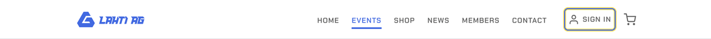 | 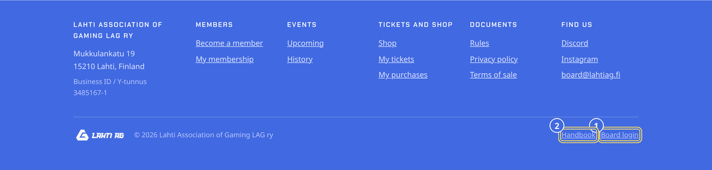 |
| Sign in with Discord, top right of every page. | The bottom of every page: 1 Board login opens the register, 2 Handbook is this guide. |

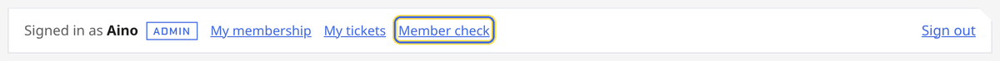

*Signed in with the Board role: the strip on the events and news pages links to the member check.*

## Who can do what

| | Any member | Board role | Register access |
|---|---|---|---|
| Sign up, buy tickets, manage own membership | yes | yes | yes |
| Create and publish events, sell tickets, run the door, shop, news | | yes | yes |
| Check whether someone is a member (name and status) | | yes | yes |
| Open the full register, approve members, export | | | yes |

Board tools sit at the bottom of a page in a folded "Board tools" block,
so nothing sensitive shows when a page is on a projector. A small pill at
the bottom right lets you view a page as a member or a visitor would.

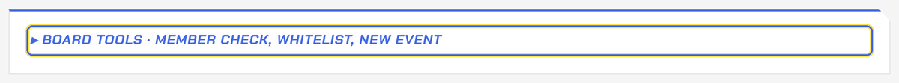

*Board tools stay folded at the bottom of the page until you click them.*

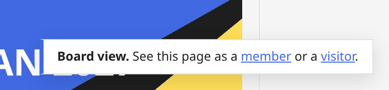

*The pill at the bottom right shows the page as a member or a visitor would see it.*

## Members

- **Joining.** People apply at lahtiag.fi/join, ideally signed in with
  Discord so their account is linked from the start. The board's private
  Discord channel gets a note; the application waits in the register.

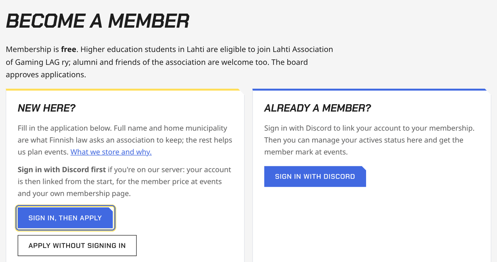

*lahtiag.fi/join: the application form. Signing in first links the Discord account from the start.*

- **Approving.** On the register page, applications are at the top with
  Approve and Reject. Approving gives the Member role on Discord (and
  Actives, if approved as an active) and posts a welcome in the general
  channel. The register shows a hint if the person may already be in it,
  with the reason, and a Merge button.

*The register's toolbar: 1 Add entry, 2 Venue lookup (the member check), 3 Access, 4 Export CSV. The tiles count members, pending applications, actives and former members.*

*Applications at the top of the register: 1 Approve or Reject; 2 the yellow hint when the person may already be in the register, with Merge into this entry.*

| | |
|---|---|
| 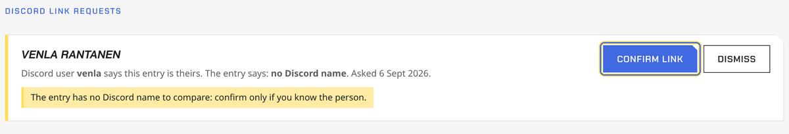 | 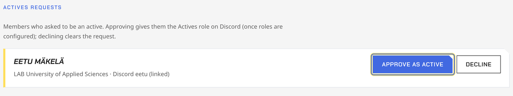 |
| A member who signed in with Discord asked to link their account: Confirm link when the names match, or when you know the person. | An actives request: Approve as active gives the Actives role on Discord. |

| | |
|---|---|
|  |  |
| An application's own page: 1 Approve membership, 2 Reject and delete. Every field below is editable. | A member's page: Mark as former member ends the membership and keeps the record. |

- **Members manage themselves** at lahtiag.fi/membership: their details,
  the actives request, linking Discord.

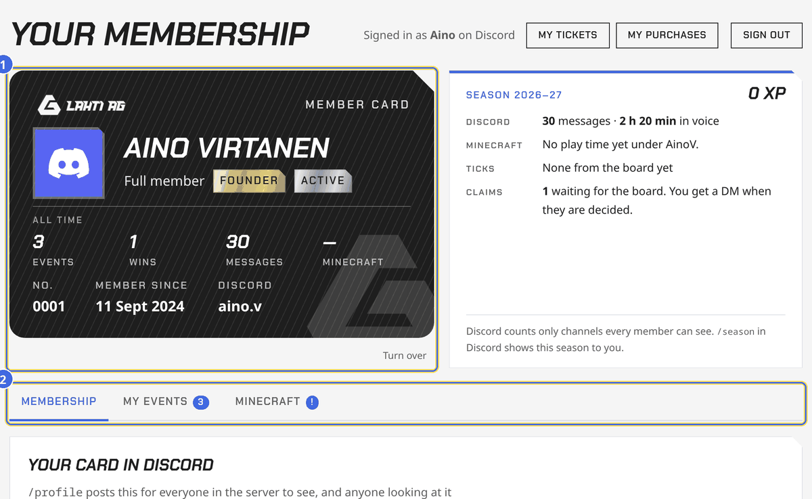

*What a member sees: the card with their stats, 1 the tabs Membership, My events and Minecraft, 2 the leaderboard opt-out.*

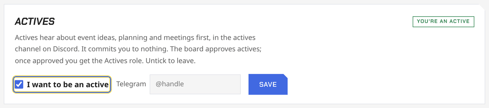

*The Actives box on the membership page: ticking it sends a request to the register, unticking it leaves.*

- **Member check.** Any board member: Board login → Member check. Type a
  name, see member or not. Nothing else.

| | |
|---|---|
|  | The member check, made for a phone at the door: type a name, see the status in big letters. Nothing else about the person is shown. |

- **Export.** Register access: the register page has a CSV export.

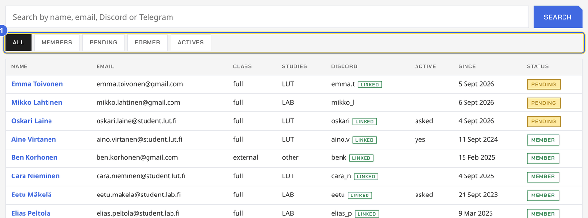

*The list: 1 filter by status or actives, 2 search by name, email, Discord or Telegram. Export CSV in the toolbar downloads what is shown.*

| | |
|---|---|
| 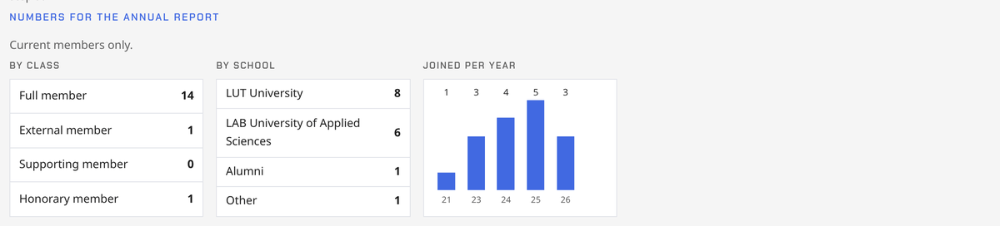 |  |
| Numbers for the annual report, at the bottom of the register. | Access: the Google accounts that can open the register. Grant access adds one. |

## Events

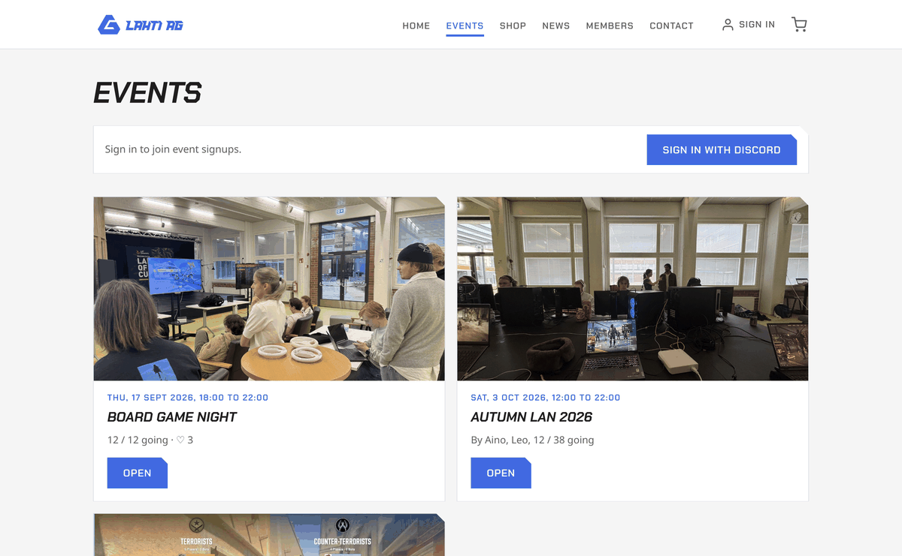

*The events page as a visitor sees it: upcoming events, then the recent ones.*

- **Create** on the events page, Board tools → New event. It is saved as
  a **draft**: only the board sees it. Add a cover picture, a description,
  the location, ticket types and questions from the event's Board tools,
  then press **Publish**. Publishing lists it, opens signups or sales, and
  posts it on Discord. Edits afterwards update the Discord post.

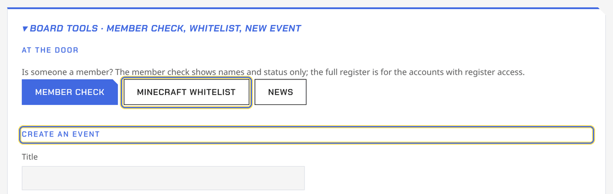

*Board tools on the events page: Member check, Minecraft whitelist and News, and the Create an event form below.*

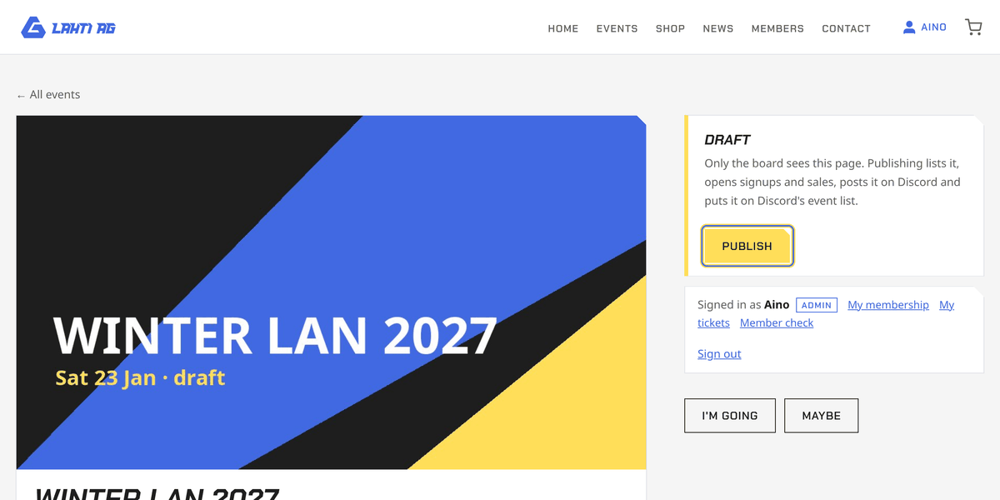

*A new event is a draft only the board sees. Publish is the yellow card at the top right.*

*Board tools on an event page: 1 the status pills, the buttons for signups and the bracket, 2 the door page, and the folded sections below, 3 Tickets among them.*

- **Signups or tickets.** An event with no ticket types takes plain
  signups. Add a ticket type and it sells tickets instead; a paid ticket
  is the signup. Set a price, a member price, members-only, a quantity,
  a sales deadline, and a line describing what the ticket includes.

*Tickets under Board tools: the sales line with 2 Door page and 1 Export CSV, then one row per ticket type.*

| | |
|---|---|
| 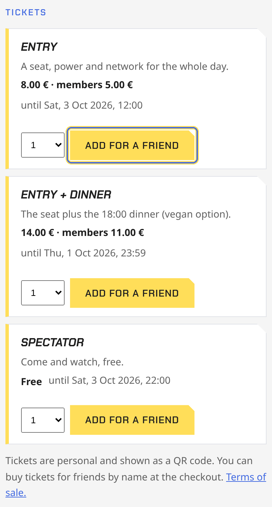 | What a member sees on the event page: one box per ticket type with the member price, and a button that adds it to the basket (Add for a friend once they hold their own ticket). |

- **Reminders.** The day before an event the bot posts a reminder in the
  event's Discord channel and pings its role; a day before a ticket
  deadline it posts how many are left; when signups open at a set time
  it posts that too. Nothing to press.
- **Duplicate.** Board tools → Duplicate as a draft copies an event a
  week later with its ticket types, questions and cover. Fix the date
  and title, then publish.

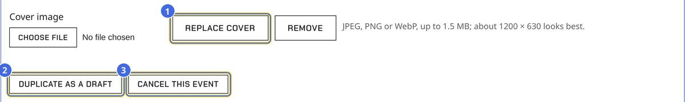

*At the bottom of Edit this event: 1 the cover picture, 2 Duplicate as a draft, 3 Cancel this event.*

- **My events.** Each member's membership page lists what they have a
  stake in: tickets, going, maybe, waitlists and hearts, upcoming only.
- **Signups open later, and the heart.** "Signups open on/at" in the
  event form holds signups and sales until that moment; until then the
  page shows the date and the ♡ Interested button. The count next to the
  heart adds up the site's hearts and the Interested clicks on Discord's
  event list, each person once.
- **Capacity and reserved seats.** The event's capacity is the total.
  "Seats reserved for members" keeps that many for members; non-members
  stop at the rest. Lowering the capacity under the going count moves the
  latest signups to the waitlist, first in line, and tells them. A full
  event with plain signups gets a **waitlist**:
  when a seat frees, the first in line is moved to Going on their own,
  the event's Discord channel tells them, and the roster shows who is
  waiting; the board can let anyone in with ✓, whatever their place or
  the capacity, or take them off with ×.

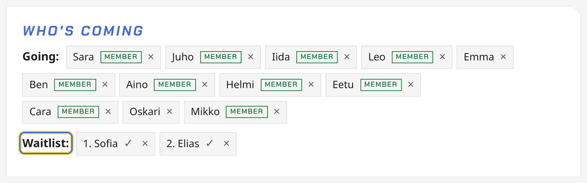

*Who's coming on a full event: the waitlist in order, with ✓ to let someone in and × to take them off.*

- **Questions** (T-shirt size, diet, team preference) are asked when
  someone signs up or buys, per ticket, and come out in the exports.

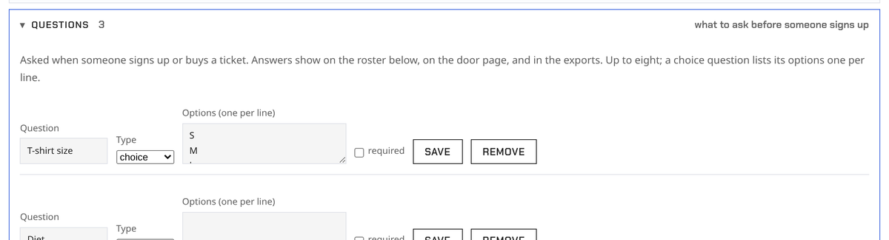

*Questions under Board tools: text, choice or checkbox, optional or required.*

- **Team captains.** Whoever founds a team can add people who signed up
  without a team and take members out, while signups are open. The
  board's Manage participants does the rest.

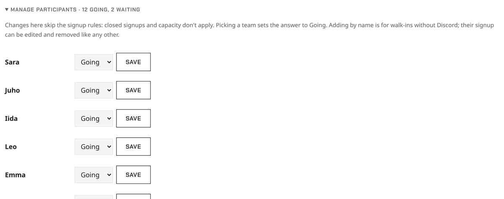

*Manage participants: change anyone's answer, move them between teams, or add a walk-in by name.*

- **Team events.** Set a team size; people form teams, or the board makes
  teams, renames them and groups loose players under Manage participants.
  Generate the bracket from Board tools: it starts as a draft only the
  board sees, the seeding can be rearranged on the bracket page, and Go
  live shows it to everyone. Substitutes are swapped in on the bracket
  page; results are recorded there or from the Discord panel.

*The bracket page while the draw is a draft: rearrange round one, 1 Save seeding, then 2 Go live.*

*After the final: the champion banner; W records a winner, ↺ on a recorded winner reverts that result.*

*`/board` in Discord: Event, Bracket and Announce & screen open the buttons; Whitelist, Register and News link to the site. Only the person who typed it sees the panel.*

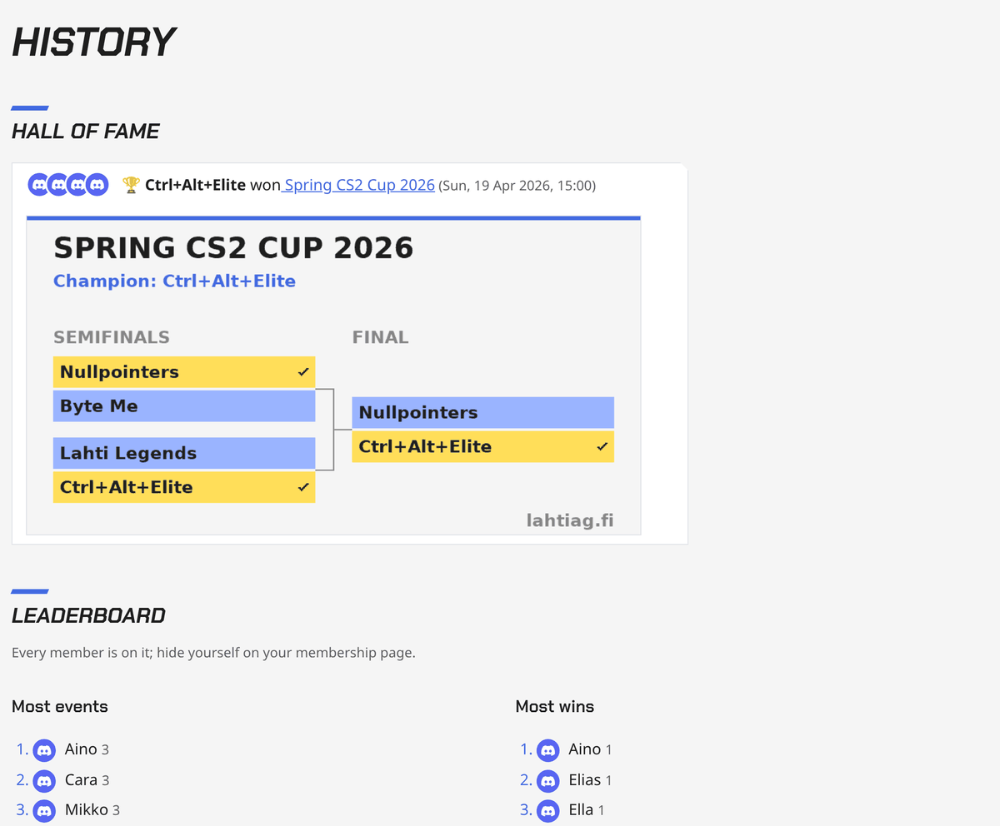

*The history page: the Hall of Fame with the final bracket picture, and the leaderboard.*

- **On Discord.** Publishing puts the event on Discord's event list
  (cover, blurb, place, link) and asks what else it gets: a role with
  one channel under Events (the usual), or for a big event its own
  category with rules, a bot-only bracket channel, teams, discussion and the Commentators and
  Interviews voice channels, plus a voice channel per team that follows
  the teams as they form.
  The role follows the roster on its own: sign up and you have it, leave
  and it's gone. A week after the event the role is removed on its own
  and the channels stay for the board. Edits and cancellations carry
  over, and the tournament
  talks in the channel: the bracket, every result, the champion and the
  screen messages are posted there by the bot. Board tools → Discord
  shows the state. Afterwards, Archive keeps the channels for the board
  and takes the role away; Delete everything removes them.
- **Photos.** Board tools → Photos takes several pictures at once; the
  page shrinks them before upload. They show on the event page and the
  history page. Up to 60 per event.

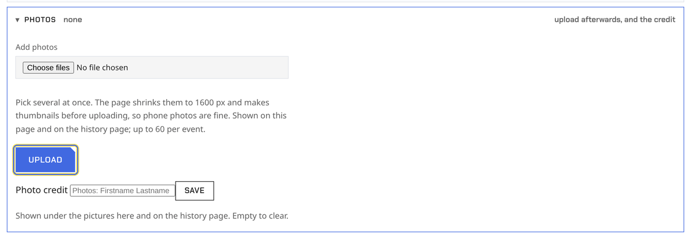

*Photos under Board tools: pick several at once, the page shrinks them before upload.*

- **Cancel** posts a cancellation on Discord and can be undone with
  Reinstate. Delete removes the event for good. Both ask first.

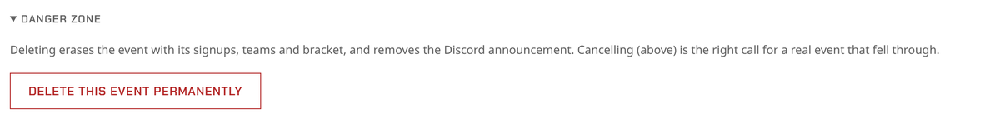

*Delete lives in the Danger zone at the bottom of Board tools, and asks first. Cancel is under Edit this event, next to Duplicate.*

## Tickets and the shop

- **Shop items.** Delete takes a product off the shop and the door for
  good; past purchases keep their line. Unticking On sale keeps it in the
  shop as "Out of stock", with the stock count still yours to edit.

- **Buying.** Event pages and the shop only add to a **basket**. The
  checkout takes names and answers for every ticket and one payment for
  everything, including tickets to several events and shop items.
  Members get member prices automatically. A person can buy tickets for
  friends by name at the public price.
- **Without Discord.** Anyone can buy without signing in; their ticket is
  a link that is also on the receipt.
- **The ticket** is a QR code on its own page, under My tickets. Tickets
  bought for friends are there too, each with its own link to pass on.

| | |
|---|---|
| 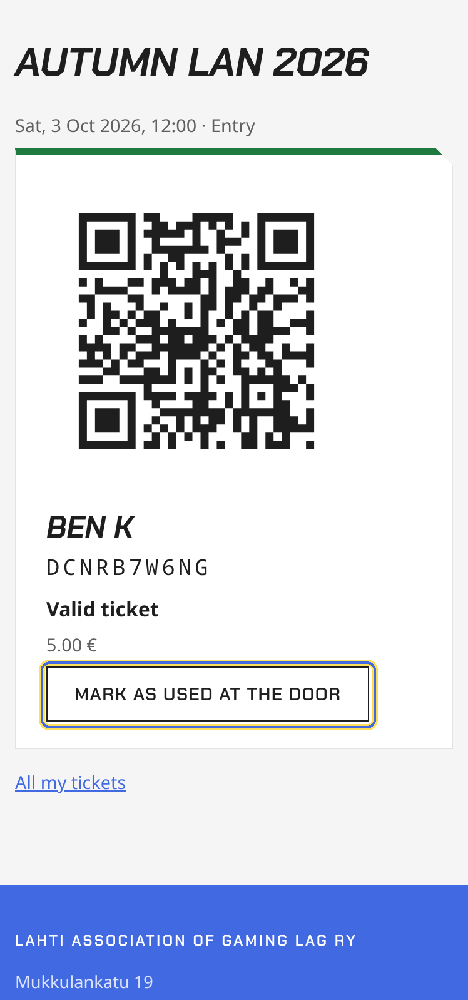 | 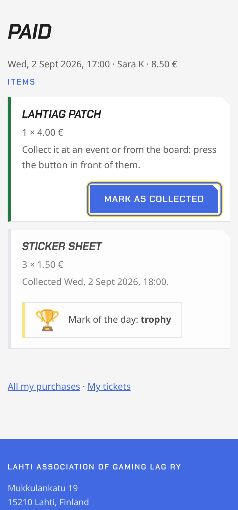 |
| A ticket: the QR code the door scans, and Mark as used for when nobody scans. | A purchase page: its tickets and items, with Mark as collected for shop items. |

- **The shop** (in the header) sells patches and such. Board tools on the
  shop page add products with a picture, prices, stock. Buyers collect
  items at an event; **Items to hand over** lists what is waiting.

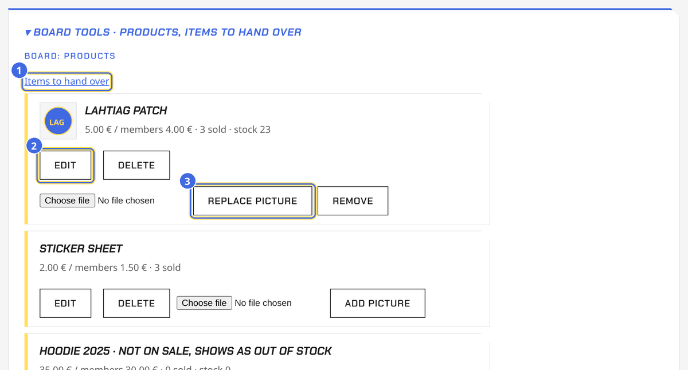

*Board tools on the shop page: 1 Items to hand over, and per product 2 Edit and Delete, 3 the picture.*

| | |
|---|---|
| 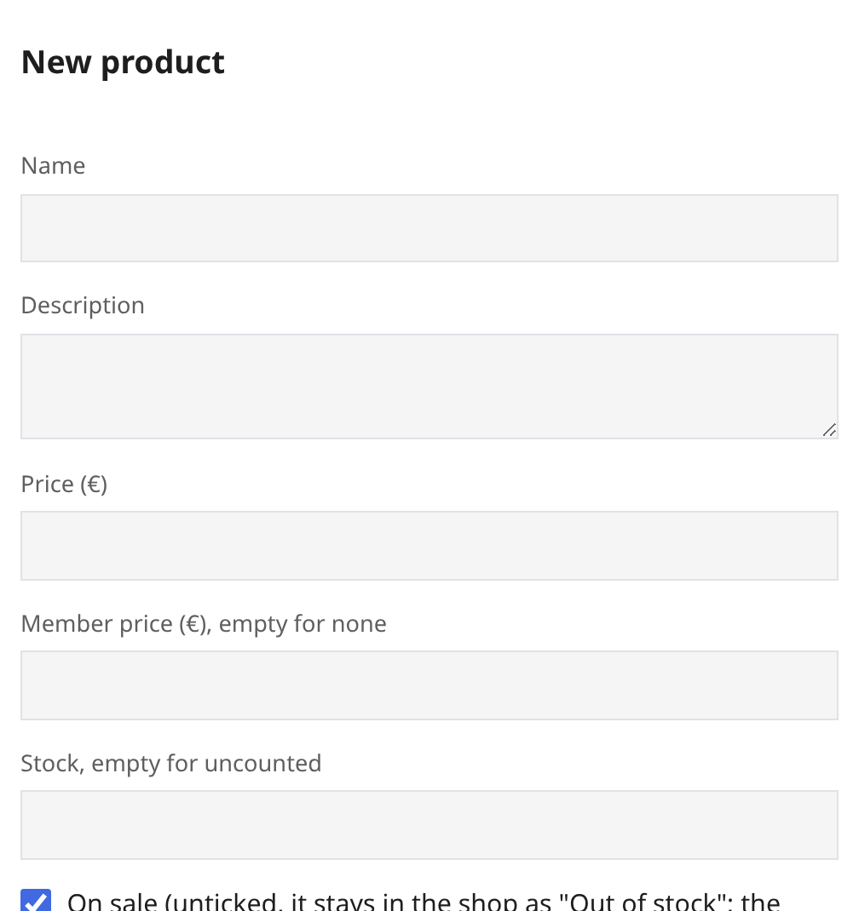 | New product, further down the same block: name, description, prices, stock, on sale. |

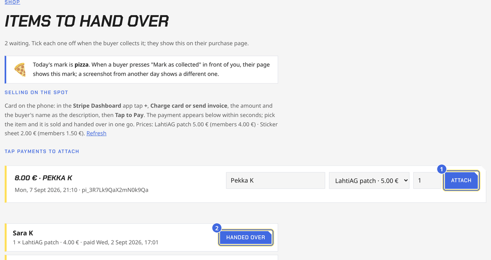

*Items to hand over: 1 a Tap to Pay payment waiting to be attached to an item, 2 paid items waiting, ticked off with Handed over.*

- **Refunds** are done in Stripe, by the chair or treasurer. A full refund
  frees the seat and removes the person from the event by itself.

## At the door

Every event has a **door page** (event page → Board tools → Door page).
On a phone it does everything:

- **Scan** a ticket with the camera, or type its code. Scanning marks it
  used; a second scan is refused. The list shows who is in.
- **Sell** to people with a phone: they scan the sales QR, pay on their
  own phone, and appear in the list.
- **Take a card** with the Stripe app on an iPhone (Tap to Pay), then
  pick the person and the ticket or item on the door page.
- **No scanner?** The holder presses "Mark as used" on their ticket in
  front of you; the ticket then shows the **mark of the day**, an icon
  that changes daily and is shown on the door page too, so a screenshot
  from another day gives itself away. Shop items work the same with
  "Mark as collected".

| | |
|---|---|
|  |  |
| The door page on a phone: the mark of the day, then 1 type the code or 2 scan with the camera. | Sell at the door: one QR per ticket type, and one for the shop. The buyer scans and pays on their own phone. |

| | |
|---|---|
|  |  |
| Card at the door: a payment taken with the Stripe app waits here with the name filled in. Pick the ticket, press Attach. | The list: who is in (green, with 2 Undo) and who is not (1 Check in). Answers to questions show under the name. |

## Money

- **Stripe** takes the payments: cards, Apple Pay, Google Pay, MobilePay,
  Revolut Pay. Buyers get a receipt by email. Payouts go to the Holvi
  account. The chair and treasurer have the Stripe login; door phones use
  the Stripe app.
- **Fees.** About 1.5 % plus 0.25 € per card payment in Europe. Refunds
  cost nothing extra, but the fee of the original payment is not returned.
- **Sales totals** are on each event's Board tools (Tickets), with a CSV
  of every ticket and its answers. The Stripe dashboard has the money
  side.

## News

Board tools on the news page. A post is saved as a draft; **Publish**
puts it on the page and on Discord.

*Board tools on the news page: the post form with 1 the cover picture, 2 who to ping on Discord, 3 the publish date and time.*

- **Scheduled news.** Save a news post with a publish date and time and
  it goes out by itself, to the site and Discord. Handy for general
  meeting notices written ahead.

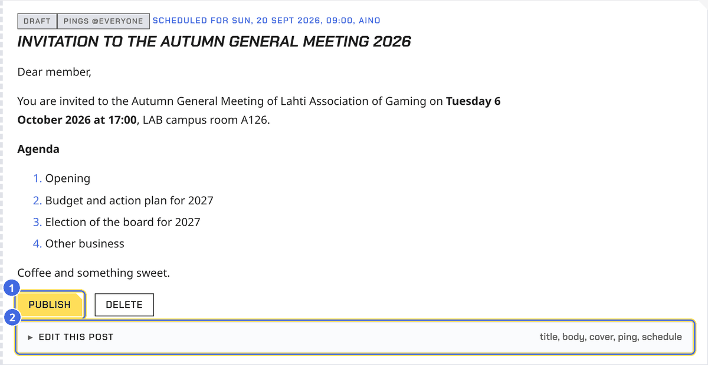

*A draft on the news page: the badges say it is a draft, who it pings and when it goes out. 1 Publish sends it now, 2 Edit this post opens the form.*

- **A picture.** The post form takes a cover picture, and each post has
  Add cover / Remove cover. It shows under the title and goes to Discord
  with the post.

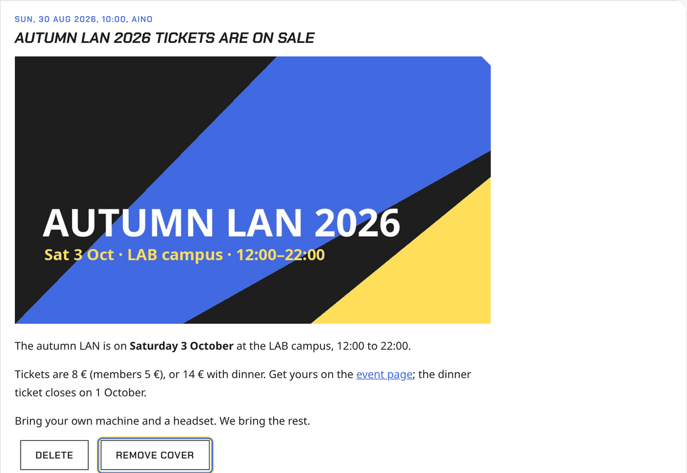

*A published post with its cover. Remove cover takes the picture off the site and the Discord post.*

- **Edit.** "Edit this post" under each post has everything the new-post
  form has: title, body, cover picture, and on a draft the ping and the
  publish time. A published post's Discord message changes with it.

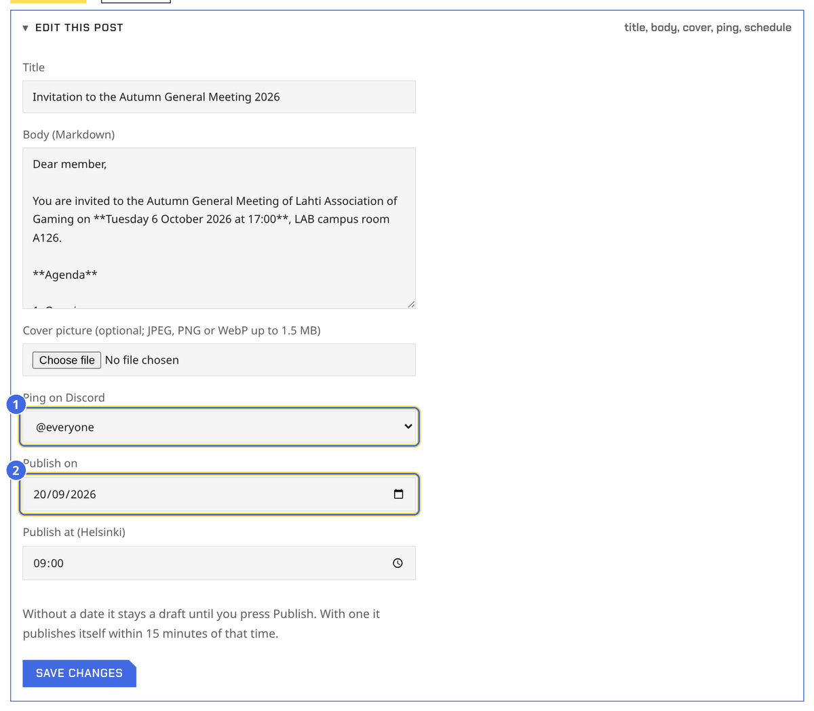

*Editing a draft: 1 the ping and 2 the publish date and time can still change.*

- **Ping.** A post can ping nobody, @everyone, or one server role (say
  Minecraft) when it goes to Discord. Pick it when writing the post, or
  on a draft's edit form; it fires once, when the post publishes.
- **The bot in Discord.** Announcements carry I'm going, Maybe and
  Interested buttons; a click signs up under the same rules as the site.
  People get a private message when put in a team or let in from a
  waitlist. Mondays at nine the bot posts the week's digest in general;
  winners get the champion role; `/next`, `/champion`, `/roll`, `/coin`
  and `/pick` are there for fun.
  Its "only you can see this" errors and confirmations clear themselves
  after about half a minute; panels, lists and anything with a link you
  still need stay until you dismiss them.
- **Activity counts.** For the coming season pass the bot counts, per
  member and month, messages sent and minutes in voice, only in channels
  every member can see. Nothing about content is kept. The membership
  page shows a member their counts; a board member also sees which
  channels count.
- **Your stats.** The membership page shows your events, tournaments and
  wins, with a card; `/profile` in Discord posts the card for everyone.

## Minecraft server

- **Members whitelist themselves.** On the membership page ("Minecraft
  server") or with `/whitelist me <name>` in Discord, and the name goes
  on every LahtiAG server (the SMP and the modpack) within about five
  minutes. Names are checked with Mojang, and the skin's face shows next
  to the name so people can tell it's their account.

*The Minecraft tab on the membership page: the server addresses, the member's names with the skin's face, 1 Change your own name, 2 Ask the board for a friend.*

*The same in Discord: `/whitelist me` answers with the skin, to that person only.*

- **Friends are applications.** A member can bring two friends
  (`/whitelist friend <name>`, with a server choice, or the membership
  page). The request lands in the board channel with **Approve** and
  **Decline** buttons any board member can press; `/whitelist pending`,
  `/whitelist approve <name>` and lahtiag.fi/whitelist do the same. The
  member gets a DM either way.

*lahtiag.fi/whitelist: friends waiting for a decision at the top with Approve and Decline, and everyone on the list below.*

- **Board.** `/whitelist add <name>` whitelists anyone, member or not;
  `/whitelist drop <name>` removes any name; lahtiag.fi/whitelist is the
  whole table, linked from Board tools on the events page and from the
  `/board` panel. A former member's names go off the servers on their own.
- **Actives requests** land in the board channel the same way, with
  Approve and Decline buttons; approving gives the Actives role at once.
- **A friend who joins.** When a friend becomes a member and whitelists
  the same name, it moves to them, and the member who brought them gets
  a DM that their friend slot is free. A former member's name is free
  for others to list.
- **The old list.** The names that were on the server before the site
  took over are on the list as board names. A member who whitelists that
  same name takes it over, and from then on it follows their membership.
  Everyone is on the public leaderboard on the history page; a tick
  there hides you.

## Where things are

| | |
|---|---|
| Register, applications, exports | lahtiag.fi/register (register login) |
| Member check | lahtiag.fi/register/lookup (Board role) |
| Events and the door | lahtiag.fi/events → event → Board tools |
| Shop and items to hand over | lahtiag.fi/shop, lahtiag.fi/shop/orders |
| News | lahtiag.fi/announcements |
| This guide, the technical handbook | lahtiag.fi/handbook, lahtiag.fi/handbook/technical |
| Money, refunds, receipts | dashboard.stripe.com |
| Rules, privacy policy, terms of sale | lahtiag.fi/rules, /privacy, /terms |
