# Running lahtiag.fi

The operations handbook for the LahtiAG website. Written for whoever runs
this after the current maintainer — board members included. Last full
revision: September 2026.

## Contents

- [What this is](#what-this-is)
- [Who can do what](#who-can-do-what)
- [Hosting a tournament, start to finish](#hosting-a-tournament-start-to-finish)
- [Events on Discord: the event list, a role and a channel](#events-on-discord-the-event-list-a-role-and-a-channel)
- [The member register](#the-member-register)
- [The privacy policy](#the-privacy-policy)
- [Selling tickets](#selling-tickets)
- [Taking payments at the door](#taking-payments-at-the-door)
  - [Set up Tap to Pay, once per phone](#set-up-tap-to-pay-once-per-phone)
  - [Take a card payment](#take-a-card-payment)
  - [Link the payment to a person](#link-the-payment-to-a-person)
  - [Buyers with their own phone](#buyers-with-their-own-phone)
  - [Shop items on the spot](#shop-items-on-the-spot)
- [The Minecraft whitelist](#the-minecraft-whitelist)
- [The Discord activity listener](#the-discord-activity-listener)
- [Editing this handbook](#editing-this-handbook)
- [Editing the site's pages](#editing-the-sites-pages)
- [The moving parts](#the-moving-parts)
- [Local development](#local-development)
- [Things that will bite you](#things-that-will-bite-you)
- [When something breaks](#when-something-breaks)

## What this is

One Cloudflare Worker serves https://lahtiag.fi. Static pages (home, members,
contact, rules, history stories) are Markdown in this repository, prerendered
at build time and served from Cloudflare's edge. Dynamic pages (events,
signups, tournaments, news, login) render in the Worker against a D1
database. There is no separate server anywhere and the whole thing runs on
Cloudflare's free tier.

- Site: https://lahtiag.fi (the `workers.dev` URL is disabled; www redirects
  to the apex via the tiny separate Worker in `infra/www-redirect/`)
- Repository: https://github.com/Valtterios/lahtiag-site — push to `main`
  deploys automatically through Cloudflare Workers Builds, live in ~2 min
- Cloudflare account: lahtiagry@gmail.com
- Calendar feed: https://lahtiag.fi/events.ics

## The front page

`src/pages/index.astro` is server-rendered: the hero and the Discord
widget, then strips from D1 with the page's own words between them — the
next three events (the same tiles as the events page, `src/lib/price.ts`
for what a seat costs), **About us**, the three newest published posts with
their first line (`newsExcerpt` in `src/lib/news.ts`), **What we do** with
the membership box beside it, and one picture from each of the six newest
events with photos (`listPhotoAlbums`). The words are
`src/content/pages/home.md`, rendered here with `marked` and split at its
`## ` headings: the first heading's piece goes in the first slot, the rest
in the second, so a file with one heading or three still renders whole. A
post with no cover shows the mark on a band, the way an event without one
does. Every query sits in one `try`: a database hiccup empties the strips,
it never takes the front page down.

## Who can do what

Everyone in the LahtiAG Discord can sign in (Sign in with Discord), sign up
to events, and form tournament teams. Holders of the Board member role (ids
in `wrangler.toml` under `ADMIN_ROLE_ID`) additionally get the admin
controls, on the site and in Discord. Access follows Discord: leaving the
server or losing the role removes access by itself — there are no separate
accounts to manage. Anyone, signed in or not, can apply for membership at
/join.

The **member register** is the exception: it holds personal data, so it
opens only to a short list of the association's Google Workspace accounts
(chair, treasurer, and whoever they add), signed in with Google — see the
next section.

## Hosting a tournament, start to finish

Everything can be run from Discord with `/board` (admin only, only you
see the panel). It opens on three categories — **Event**, **Bracket**, and
**Announce & screen** — and each button below lives in one of them (Back
returns to the categories):

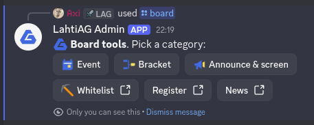

*`/board` in Discord: Event, Bracket and Announce & screen open the buttons; Whitelist, Register and News link to the site. Only the person who typed it sees the panel.*


1. **📅 Create event** (Event) — fill the form. A team size makes it a
   tournament-style event where members form their own teams on the site;
   empty means individual signups. On the site's form there is also
   **Reserves per team**: places beyond the line-up, so five-a-side with
   one reserve is a team of six, one of them starting on the bench. The
   announcement posts itself to the webhook channel.
2. Members sign up (and create/join teams) on the event page.
3. **🔒 Close signups** (Event) when the field is set.
4. **🎲 Generate bracket** (Bracket) — random seeding, byes handled
   automatically. The draw is a **draft** only the board sees: on the
   site's bracket page, rearrange round one if you want (a bye is an
   empty second side), save, then **🚀 Go live** (panel or site), which
   shows it to everyone and posts it to the event's channel. The same
   Generate button re-draws from scratch, back to a draft.
   An event can run **several brackets** — a main draw and a plate, one
   per game, a bracket per group. Add them under *Another bracket* at the
   bottom of the bracket page (name it, and tick who is in it), or with
   `/bracket generate event:<id> name:<name>`. Each one drafts, goes live
   and records its results on its own, and the bracket page puts them
   side by side. The panel's Generate and Go live buttons look after an
   event's single bracket; when it runs more, Generate points at the
   site and Go live asks which one. Record winner and Revert result name
   the bracket beside each match, so they keep working either way.
5. Put the bracket on the venue screen: open the event's bracket page as an
   admin, click **Open presenter mode**, fullscreen it (F11). It scales to
   fill the display and refreshes itself every 10 seconds. The direct URL is
   `/events/<id>/bracket?display` if the display machine isn't signed in.
6. **🏆 Record winner** (Bracket) after each match — the pick appears on
   the venue screen within ten seconds. Repeat down to the champion; the
   banner and the Hall of Fame on /history update themselves.
   **↩️ Revert result** undoes a recorded win: the match becomes undecided
   again and everything that followed from it is cleared. On the website
   the ↺ button on the recorded winner does the same.
   A **substitute** (someone dropped out, a walk-in stepped in) is done
   on the bracket page: add them to the roster first, then Out/In under
   Substitute; they take over the place and any results. Teams are
   renamed under Participants on the event page, and the name
   carries to the bracket, the pictures and the team's voice channel.
7. **💬 Screen message** (Announce & screen) puts a one-line banner on the
   venue screen ("Finals in 5 minutes!"); submit it empty to clear.
8. **📣 Announce** publishes to the site's News page and the Discord channel
   at once. **❌ Cancel event** (Event) if the day falls through.

| | |
|---|---|
| 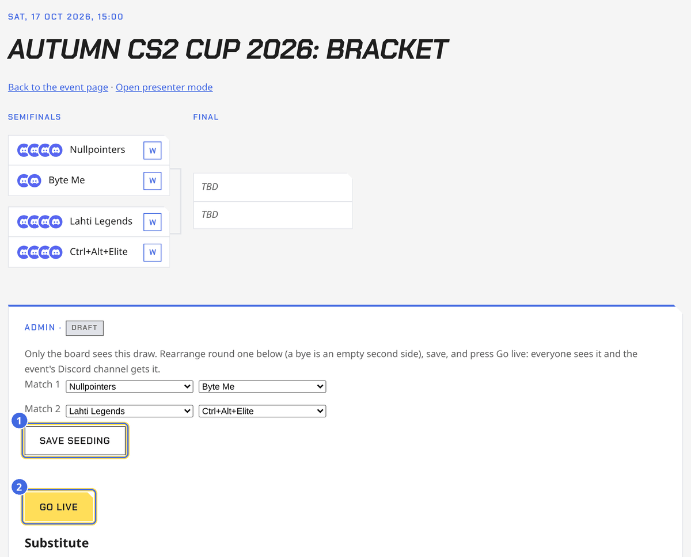 | 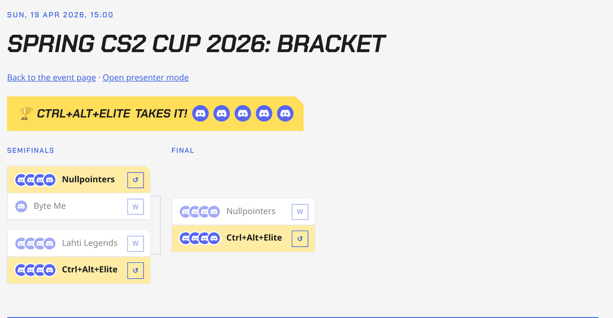 |
| The bracket page while the draw is a draft: rearrange round one, 1 Save seeding, then 2 Go live. | After the final: the champion banner; W records a winner, ↺ reverts a result. |

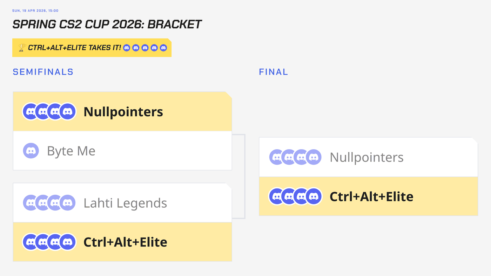

*Presenter mode (`?display`) on a 1080p screen: the chart scaled to fill it, refreshing itself every ten seconds.*

Editing event details (times, capacity, organizers, stream link,
description) and permanently deleting an event are done on the website —
event page → Admin. Delete (in the Danger zone) erases signups, teams, and
bracket, and removes the Discord announcement; cancel keeps the history.
A cancelled event has a **Reinstate this event** button: it takes the
"Cancelled" line off Discord and posts that it's back on. Destructive
buttons on the site (cancel, delete, reject, erase, remove access, merge,
regenerate bracket) ask "are you sure" first.

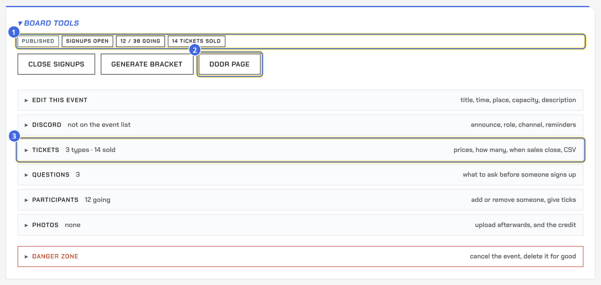

*Board tools on an event page: 1 the status pills, 2 the door page, 3 the folded sections — each says what it holds now and what is inside (Edit, Discord, Tickets, Questions, Participants, Photos), with the danger zone kept apart in red. Every board panel on the site is built this way: pills for where things stand, the day's buttons, then folded rows.*

The Admin panel's **Participants** section edits the roster directly,
skipping the normal signup rules (closed signups, capacity): change anyone's
answer (Going/Maybe), move them between teams (team size still holds), or
**add a walk-in participant by name** — someone without Discord. A manual
participant behaves like any other signup afterwards: they land in brackets,
can be edited, removed (× on their chip), and purged.

Winner clicks on the *website* re-verify your role against Discord each
time; the Discord panel doesn't need to and is immune to rate limits — on
tournament day, prefer the panel.

**Replies that clear themselves.** Discord keeps no timer on any message,
so the bot deletes its own: an error or a plain confirmation ("Signups
closed", "Approved", "You're going") goes away about half a minute after
the command. The panel, its pickers, listings (`/whitelist list`,
`pending`), `/membership`, and any reply that hands you a link to carry on
with (a created event, a drafted bracket) stay until you dismiss them. The
delete rides on the interaction token, so it only works inside Discord's
15 minutes and the Worker's ~30 s after the response; a slow reply is
simply left standing (`dismissReply` in `src/lib/discord.ts`).

## Events on Discord: the event list, a role and a channel

**The 15-minute job.** A Cron Trigger runs the Worker every quarter hour
(`src/lib/cron.ts`): the day before an event starts it posts a reminder
into the event's channel with the role pinged (or into the announcements
channel, without a ping, when the event has no channel); a day before a
ticket deadline it posts "ticket sales close tomorrow" with what is
left; when a "signups
open at" moment passes it posts "Signups are open" to the announcements
channel and the event's channel; it tells people let in from a waitlist;
it refreshes the Interested counts from Discord; and a week after an
event ends it archives its Discord set on its own (the role goes, the
channels stay for the board, Delete everything when you're done with
them). Each step is recorded on the event, so nothing is posted twice.

**Waitlist.** A full event with plain signups, a capacity and no ticket
types offers "Join the waitlist". Whenever a seat frees (someone leaves
or steps back to maybe, the board removes someone, the capacity is
raised, a member is erased) the first in line becomes Going, and the bot
mentions them in the event's channel. Team events and ticketed events
have no waitlist.

**Interested.** People who press Interested on Discord's event list are
read back by the bot (at most every two minutes, when someone opens the
event page) and counted with the site's own ♡ Interested button; each
person counts once. "Signups open on/at" in the event form holds signups
and sales until then, so an announced event can collect interest first.

**Scheduled news.** A news post saved with a publish date and time goes
out on its own within 15 minutes of that moment, to the site and to
Discord, for a general meeting notice written ahead. Publish sends it
right away instead.

**Who a news post pings.** The post form has a Ping choice: nobody,
@everyone, or one of the server's roles (the bot lists them; without the
bot only @everyone is offered). The mention goes in front of the Discord
message when the post publishes, by hand or on its schedule, and never
again.

**A picture on a news post.** The new-post form takes an optional cover
(JPEG, PNG or WebP up to 1.5 MB), and every post on the news page has
Add cover / Replace cover / Remove cover for the board. The picture shows
under the title on the site and goes to Discord attached to the post; a
cover changed after publishing replaces the picture on the Discord
message too.

**A post on Discord is several messages.** The cover goes first as a
message of its own, then the text in as many messages as it takes, the
first carrying the ping and the title: a Discord message holds 2000
characters, and `newsParts` (`src/lib/news.ts`) packs whole paragraphs
into each, cutting a paragraph longer than a message at a space. Every
message id is kept in `announcements.discord_messages` (JSON, image and
parts; `discord_message_id` is the first text part, and posts from
before the split carry only that one message with the cover attached to
it), so an edit rewrites every part, adds or drops parts as the length
changes, a new cover replaces the cover message, and a delete takes all
of them. If Discord refuses the first part (down, a bad webhook), the
site keeps the post as published and says so; a **Post to Discord**
button under the post (`/announcements/discord`) sends it again once the
post has no Discord message yet. **Unpublish** (`/announcements/unpublish`,
`unpublishAnnouncement`) makes a published post a draft again and
deletes its Discord messages; Publish then posts it afresh, ping
included.

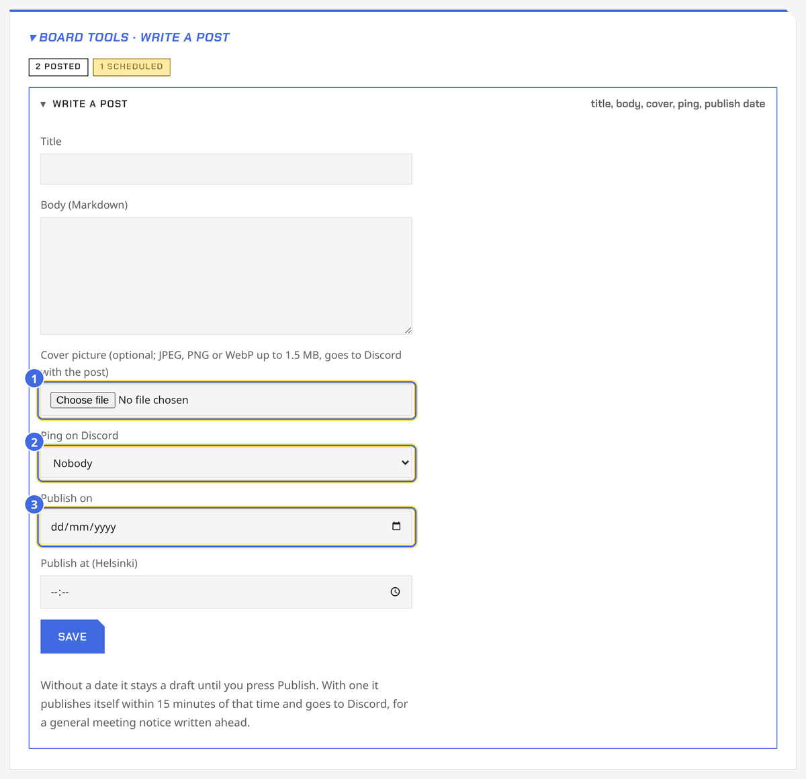

*The post form under Board tools on the news page: 1 the cover, 2 the ping, 3 the schedule.*

**The membership card.** The membership page heads with the member's own ID
card (`src/components/MemberCard.astro`): name, number (the register id),
class, member since, and four figures from the whole record, not one season
(`lifetimeTotals` in `src/lib/season.ts`). The stock is the class in the rules —
blue a full member, white an external or supporting one, yellow an honorary
one, ink the board, and the same white with a dashed edge for an
application still in the queue or a membership that has ended. Active is a
role, not a class, so it is a chip struck in foil rather than a stock. It turns over for the rest, and the back
carries the mark stamped in foil — the brand file used as a mask over a
metallic gradient that slides as the pointer moves. All of it is CSS in
`site.css`; nothing is rendered to an image, so it costs no worker time.
Where there is no pointer, the light comes to the
turn instead: one sweep across the face as the card comes round.
`prefers-reduced-motion` stops all of it.

**The card in Discord.** `/profile` posts the membership card — the same
code the page draws with (`src/lib/member-card.ts`), so the preview on the
membership page cannot drift from what the channel sees. Two buttons sit
under it: one turns it over, which anyone looking may press, and one
links to the membership page — where the card comes from, and where
everything it leaves out lives. The link goes to whoever presses it, not
to whoever the card is of, so it reads the same on anybody's card.

It is not the same *card*, though, and must not become one: `/profile` is
public and works on anybody, so the full name, the member number and the
membership class are all left off. What goes on is what Discord already
knows or the association says out loud — the display name, the avatar, the
stock, since when, and the figures. Hiding yourself from the leaderboard
takes every figure off and stops anyone else drawing your card at all;
your own you can always draw.

The Worker draws it rather than a browser: `raster.ts` is a truecolour PNG
encoder with an alpha channel (for the cut corners) and `png-decode.ts`
reads back both the avatar from Discord's CDN and the brand files from the
site's own origin — so the wordmark and the mark are the real ones, not
type, and the mark on the back is struck in silver by painting metal
through its alpha. They are decoded once per isolate. The old stats picture (`profile-card.ts`) stays for
the champion cards posted to an event's channel.

**Founders.** `register.founder`, a checkbox on the entry page for anyone
with register access. Not a class and not a role anyone is elected to, so
it is its own flag: it gives them the ink stock and a gold chip in place of
the board one, on the site and in Discord.

**Backups.** D1 keeps thirty days of point-in-time history on its own
(`npx wrangler d1 time-travel info lahtiag` shows the current bookmark;
`restore` takes a timestamp or bookmark, and is best drilled on
`lahtiag-preview` first). A full SQL export is
`npx wrangler d1 export lahtiag --remote --output ~/Backups/lahtiag/<date>.sql`;
it holds the member register, so it stays on an encrypted disk and never
in the repository.

**Duplicate.** Board tools → **Duplicate as a draft** copies an event a
week later with its ticket types (deadlines dropped), questions and
cover, as a new draft: fix the date and the title, then publish. The
roster, the bracket and the Discord objects are not copied. The history
page shows each tournament's final bracket picture under its champion.

**The announcement.** Publishing posts the announcement to the
announcements channel, by the bot itself, with the cover attached (when
there is one), a line of counts (going, maybe, interested) and buttons:
**I'm going**, **Maybe** and **Interested** on a plain event, **Tickets**
and **Interested** on a ticketed one. A click makes the signup on the site
under the page's rules (members only, capacity, the waitlist when full)
and answers the person privately. The counts on the post follow every
change, from Discord or the site, and the job re-checks them hourly. Events
with required questions send people to the site instead. For this the
bot needs **View Channel**, **Send Messages** and **Attach Files** in the
announcements channel (allow its role there if the channel is locked);
without them the plain webhook post goes out, buttons excluded. Board
tools → Discord → **Repost announcement** deletes the post and makes a
fresh one, for an event announced before the buttons or after fixing
the permissions. A new cover swaps the picture on the post.

**Champion role.** The register page's Discord roles section has a
"Reigning champion" pick: when a final is recorded the bot gives that role
to the winner or the winning team and takes it off the previous holders.

**Private messages.** The bot messages team founders when someone joins
their team, and people directly when they are put
in a team by its captain or the board (also when loose players are
grouped), and when a waitlist seat frees; only when their DMs are closed
does it mention them in the event's channel instead.

**The Monday digest.** Every Monday at nine (Helsinki) the bot posts to
the general channel: events in the next two weeks with going and
interested counts, last week's champion, and how many new members joined.
Nothing is posted in a week with nothing to say.

**Milestones.** For members on the leaderboard (everyone who hasn't
hidden themselves on their membership page): their 5th, 10th,
25th, 50th and 100th event attended, and their 1st, 5th and 10th
tournament win, each cheered once in the general channel.

**Fun commands.** `/roll [sides] [count]`, `/coin`, `/pick options`,
`/next` (the coming events) and `/champion` (the latest title holder)
answer in public. Register new commands with `scripts/register-commands.mjs`.

**Photos posted.** When photos are added, the bot posts up to four of
them with a link to the rest into the event's channel, or into the general
channel (the welcome webhook) when the event has none. Never into the
announcements channel.

**The event list.** When an event is published (or created straight from
`/board`), the bot puts it on Discord's own event list, the "Events"
entry at the top of the channel list, with the cover picture, the first
paragraph of the description, the place and the sign-up link. Members can
mark themselves interested there and Discord reminds them. Edits, a new
cover and a changed time carry over; cancelling removes it, reinstating
makes it again; deleting the event deletes it. Events that already started
are left alone. An event published before the bot did this has a
**Create Discord event** button in Board tools → Discord.

**A role and channels.** The Publish card asks what the event gets on
Discord; events created from `/board` get the first option:

- **A role and one channel under Events** (the default). A text channel
  named after the event under an **Events** category the bot creates the
  first time and keeps for all such channels (rename or move it freely;
  if it is deleted, the next event makes a new one).
- **A role and an own category** for a big event: a category named after
  the event holding `rules` (participants read, the board posts),
  `bracket` (the bot alone writes there: the pinned live bracket), `teams`,
  `discussion`, and the **Commentators** and **Interviews** voice
  channels, and a voice channel per team, named after it. Those follow
  the teams on their own: a new team gets one, a disbanded team loses
  it, and **Refresh team voice channels** in Board tools → Discord does
  the same by hand if Discord was down at the time.
- **Nothing** beyond the event list.

A one-channel event that grows has **Upgrade to own category**: the
channel moves in as discussion and the rest is added. The bot sets each
channel's permissions once and never touches them again, so lock a
channel in Discord (say, Commentators for the casters only) and it stays.

Either way the bot makes a role named after the event that only the role
(and the board) can see the channels with, posts a welcome line in the
discussion channel, and gives the role to everyone already on the roster.
From then on
every signup, team join and paid ticket gets the role, and every
departure, removal, refund or erasure loses it; the event page shows
participants a link to the channel. Walk-ins added by name have no Discord
account and are skipped, and so is anyone who signed up but hasn't joined
the server yet (they get the role at the next sync after they join).

**The tournament talks in its channel.** Whatever the board does to the
event, from the site or from `/board`, the bot also says in the
event's discussion channel: signups closed or reopened (with the count),
the bracket drawn (first-round pairings and who skips ahead, with a ping),
each recorded result with the winner's next opponent, a reverted result,
the champion (with a ping), the venue-screen message (with a ping), a
cancellation or a reinstatement, and a new time or place. Other edits stay
quiet. Events without a channel get none of this. The bot also keeps a
**pinned live bracket**: posted when the bracket is drawn, edited after
every result and revert, with the winners ticked and the champion on top,
so latecomers see the standings without scrolling. An event running more
than one bracket gets one pinned message per bracket, each under its
name, and every line the bot posts about a result says which draw it
happened in. A big event has it in
its `bracket` channel, where nobody else can write; a one-channel event
has it pinned in its channel. The bracket also comes as a **picture**,
drawn by the site itself in a pixel style: attached to the "bracket is
out" line, swapped on the pinned message after every result, and on the
champion's line. The same picture is the link preview of the bracket
page and can be shown on a screen from `/events/<id>/bracket.png`.

The panel shows how many participants hold the role. **Sync now** repairs
drift (someone who joined the server after signing up, a change Discord
refused) and does at most 40 changes per click. Afterwards, a one-channel
event has **Remove role and channel**, which deletes both, messages
included. A big event has two: **Archive** removes the role, so
participants lose access while the board keeps the channels and their
history, and **Delete everything** removes the category with every
channel in it. Deleting the event on the site removes all of it too;
cancelling leaves it. Editing the title renames the role and the category
or channel.

The bot needs, on its own role (Server Settings → Roles → the role named
after the application): **View Channels**, **Manage Roles**, **Manage
Channels**, **Create Events**, **Manage Events**, **Send Messages**,
**Manage Messages** and **Pin Messages** (the last one is what pins the
live bracket; Discord split it out of Manage Messages). Create Events
and Manage Events are separate too: the first makes entries on the event
list, the second edits and removes them. Re-inviting it with those
permissions ticked does the same in one go:
`https://discord.com/oauth2/authorize?client_id=1544746714135793756&scope=bot&permissions=2269400858176528`.
If Discord refuses ("the bot's role needs Manage Roles, Manage Channels,
Create Events and Manage Events"), one of those is missing. New roles land at the bottom
of the list, below the bot's, so the order takes care of itself.

## The member register

The association's member list (the one the Associations Act requires) lives
on the site at **/register**, replacing the Google Form + Sheet. The way in
is the footer link **Member register (board)** on every page; anyone else
who clicks it only sees "Board members only".

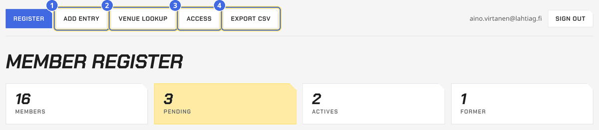

*The register: 1 Add entry, 2 Venue lookup, 3 Access, 4 Export CSV, and the counts.*

**Who can open it.** Not the Discord role: the register needs a sign-in
with a lahtiag.fi Google Workspace account that is on the access list. The
sign-in lasts eight hours (a separate cookie from the Discord one; "End
register sign-in" on the page ends it early, do that on a shared device).
The access list has two parts: the fixed accounts in `wrangler.toml`
(`REGISTER_ADMINS`, the recovery path — chair and treasurer) and the
accounts added on the register's **Access** page. Anyone with access can grant it to another lahtiag.fi address
or remove one; nobody can remove themselves, and the fixed ones can only be
changed in `wrangler.toml`. Removal takes effect on the person's next
click, signed in or not. When a board changes: add the new chair/treasurer
on the page, remove the old ones, and update `REGISTER_ADMINS` at leisure.

Google side (one-time, done in the association's Google Cloud console under
the Workspace): APIs & Services → OAuth consent screen, user type
**Internal** (only lahtiag.fi accounts can even start the flow) → Credentials
→ Create OAuth client ID, type *Web application*, authorised redirect URIs
`https://lahtiag.fi/auth/google/callback` (and the preview Worker's
`https://lahtiag-site-preview.<account>.workers.dev/auth/google/callback` if
previews should reach the register). Put the client id and secret in with
`npx wrangler secret put GOOGLE_CLIENT_ID` / `GOOGLE_CLIENT_SECRET`. Until
both exist the register answers "Register access isn't set up yet" to
everyone, including the fixed accounts. Turn on 2-step verification for the
Workspace accounts on the list; the register is only as safe as they are.

- **Applying**: /join is the public form (linked from the Members page and
  the front page). Full name, home municipality, email, school and student
  union are required; Discord and Telegram names, games, "I want to be an
  active", and a message are optional; the consent box is required. An
  applicant who is signed in gets their Discord account linked
  automatically. New applications are announced to the board's private
  channel when the `BOARD_WEBHOOK_URL` secret is set.
- **Deciding**: pending applications sit at the top of /register with
  Approve / Reject. Approve makes them a member and records who decided;
  Reject deletes the application (a refused applicant's data has no reason
  to stay). Nothing is emailed either way: tell them on Discord or by mail
  if you like. Someone who applied while signed in sees their status on
  /join.

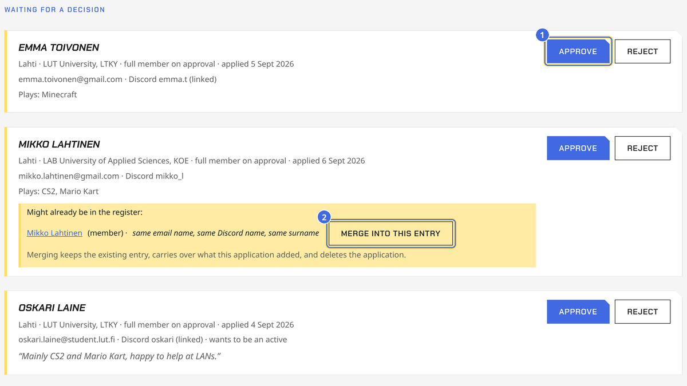

*Applications at the top of the register: 1 Approve or Reject, 2 Merge into this entry on a hinted duplicate.*

- **Membership type** follows the rules (4 §): *full* (current LUT/LAB
  students, set automatically from what they picked), *external* (everyone
  else who applies; the old sheet called this "outside"), *supporting* and
  *honorary* (board-set only, on the entry page). The sheet's "Membership
  type" column is imported and mapped onto these.
- **The list**: searchable by name, email, Discord or Telegram name
  (accents don't matter: "aijo" finds Äijö), filterable by status and
  actives. Click a name for the full entry: every field is editable
  (including linking a Discord id by hand — Developer Mode → Copy ID), plus
  a board-only note. **Mark as former member** ends a membership but keeps
  the record; **Erase** deletes it for good, which is the answer to a GDPR
  erasure request. Event signups are separate data: "Remove a member
  everywhere" on /events handles those.

| | |
|---|---|
| 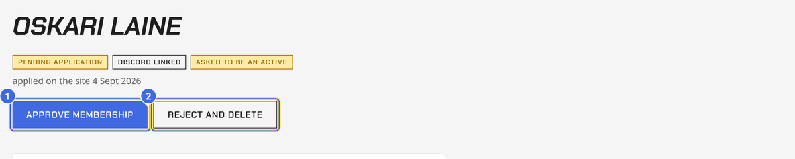 | 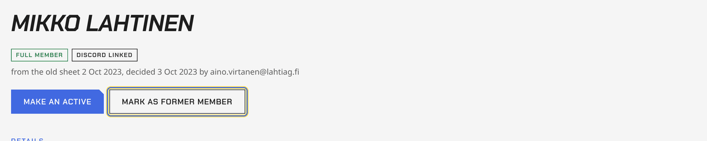 |
| An application's page: 1 Approve membership, 2 Reject and delete. | A member's page: Mark as former member keeps the record. |

- **Add entry** (toolbar) is for people who don't come through the form:
  honorary members invited by the general meeting, supporting members,
  applications on paper. The entry records who added it.
- **Hints on applications**: a red note when someone says LUT/LAB but
  applies from a non-student address, a yellow one when a similar name,
  email or Discord name is already in the register. Each hinted match has
  **Merge into this entry**: keeps the existing entry, carries over what
  the application added (latest domicile, school, union, handles, games,
  message, the actives request, and the Discord link if they applied
  signed in), and deletes the duplicate application.
- **Members' own page** (/membership, footer link "My membership"): a
  linked member sees their status, the actives request, and edits every
  detail they gave on the application themselves (name, municipality,
  email, school, union, games, message). Class, status and the Discord
  link stay with the board. `/membership` in Discord answers the same
  status privately; after changing commands run
  `scripts/register-commands.mjs` once (see Slash-command definitions).
- **Housekeeping** appears on the register when there are applications
  older than 60 days nobody decided, or former members two years on. It
  suggests; nothing is deleted on its own.
- **Numbers for the annual report** sit at the bottom of the register:
  current members by class, by school, and joined per year.
- **Access** (toolbar) is the list of Google accounts that can open the
  register; see "Who can open it" above.

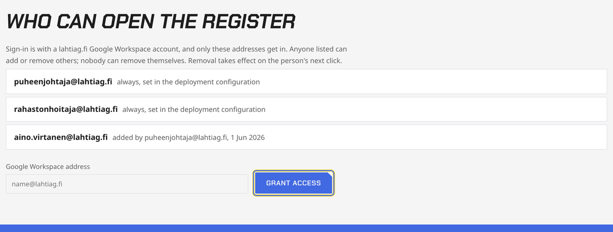

*The Access page: the fixed accounts from the configuration and the ones granted on the page.*

- **Discord link requests**: a member from the old form who signs in with
  Discord can ask, on /join, to have that account linked to their entry by
  giving the email they registered with. The request shows at the top of
  /register with the Discord name the entry already had next to the
  requesting account: **Confirm link** when they match (or you know the
  person), **Dismiss** otherwise. Nothing tells the requester whether the
  email existed. Once linked, the member manages their own actives status.
- **Actives**: a member ticks "I want to be an active" (on the
  application form or, once linked, on their membership page). That is a
  request, and it reaches the board three ways: a line in the board
  channel with **Approve** / **Decline** buttons, the **Actives** page at
  /board/actives, and **Actives requests** on /register. The first two
  take the Discord Board role, so the whole board can decide; /register
  needs register access. A request ticked on the application form waits
  for the membership itself: approving the application posts it, and so
  does adding someone by hand as a member with the box ticked — before
  that they are not a member and there is nothing to approve. Approved
  actives with a linked Discord account get the Actives role, which is
  what opens the actives channel; gate the channel on that role in
  Discord. A member unticks the box to leave, which drops the approval
  and the role. The **Actives** filter on /register lists approved
  actives; /board/actives is the same list carrying only a name, a handle
  and a date.
- **Discord roles**: linked members carry the Member role, approved
  actives the Actives role, set as decisions are made on the register.
  **Sync Discord roles** (bottom of /register) reconciles everyone, 40
  changes per click. Needs the bot: step 9 of
  docs/register-access-setup.md. Until then the register works, only the
  roles are skipped.
- **Member check for the rest of the board**: /register/lookup with the
  Discord Board role (no Google sign-in) shows names and membership status
  only, nothing else. It is linked as **Member check** from the Events
  page admin panel and the signed-in strip, for the door at events.
- **At the door**: /register/lookup is the phone view. Type a name, see
  MEMBER / PENDING / FORMER in big letters. On event pages, admins also see
  a small *member* mark next to signups from linked Discord accounts.

| | |
|---|---|
| 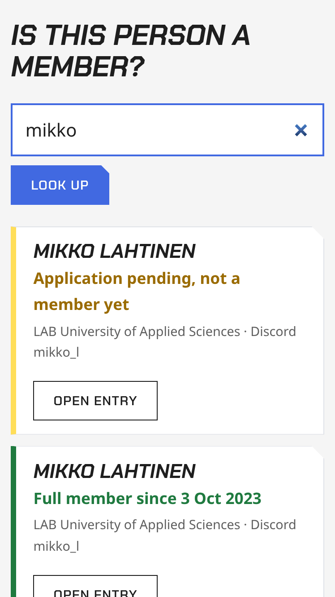 | The member check on a phone: a name in, the status out, nothing else. |

- **Export**: the Export CSV button on /register downloads the list (or the
  filtered status) for the annual report or a backup. Treat the file as
  personal data: keep it in the association's Drive, not on a laptop
  desktop.
- **Search caveat**: matching is ASCII case-insensitive only, so "äijö"
  and "ÄIJÖ" differ. Search a lower-case fragment if in doubt.
- **Spam**: the form has a hidden honeypot field and refuses duplicate
  emails. If junk applications ever show up, add Cloudflare Turnstile
  (needs a script-src CSP entry for challenges.cloudflare.com) — not done
  because it hasn't been needed.

Importing the old sheet (one-time, done from a laptop, never from the
Worker): see the header of `scripts/import-register.mjs`. In short: export
the responses sheet as CSV, `node scripts/import-register.mjs file.csv
--dry-run` to check the column mapping, then generate the SQL and apply it
with `npx wrangler d1 execute lahtiag --remote --file=…`. Both files are
gitignored (`*.csv`, `*.import.sql`); shred them afterwards.

### The entry page

One member's page (`/register/<id>`) is the toolbar, the name with its
badges, the decisions the board can make right now, then **Details** as a
card — three fields to a row where the screen allows — and, folded away
in red at the end, **Erase this entry**. Erasing is for the person's own
request or cleanup and has no undo; ending a membership without losing the
record is "Mark as former member" among the decisions above.

## The privacy policy

The association's documents are served by the site as PDFs in the brand
style: `/privacy-policy.pdf`, `/rules-fi.pdf` (the registered Finnish
rules) and `/rules-en.pdf` (the English translation), files in `public/`,
linked from the Privacy and Rules pages. Their source text is Markdown in
`docs/` (`privacy-policy-<date>.md`, `rules-fi.md`, `rules-en.md`). To
change one: edit the Markdown (the rules only when the general meeting has
changed them), render with

    python3 scripts/brand-pdf.py docs/rules-fi.md public/rules-fi.pdf --meta "Säännöt · hyväksytty 23.10.2024"

(needs pandoc and Chromium), push, and upload the same PDF as a new
version of the copy in the association's Drive.

## Selling tickets

An event sells tickets when it has at least one ticket type (event page →
Admin → **Tickets**). Team events keep plain signups. Everything about
tickets lives in docs/superpowers/plans/2026-09-05-tickets.md; the short
version:

- **Ticket types**: name, price (0 = free ticket), member price (for
  linked members), members-only, quantity, sales close (default: when the
  event starts), on sale or not. A type with sold tickets can't be deleted,
  only retired.

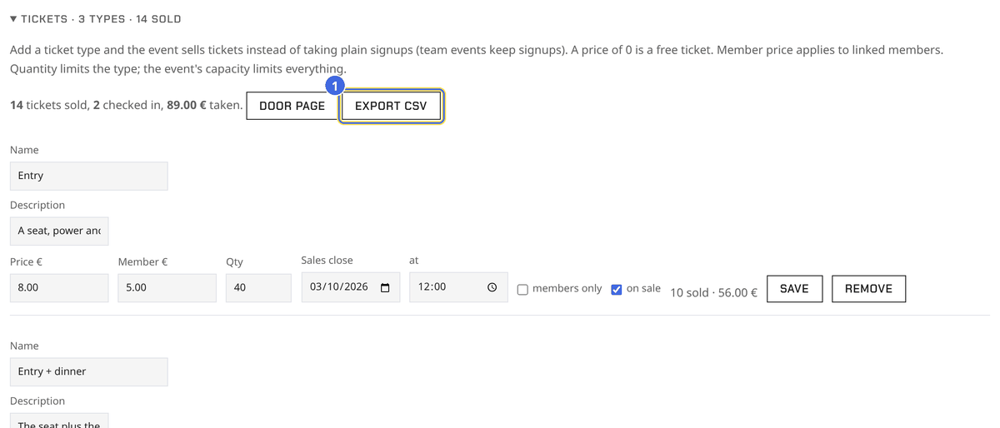

*Tickets under Board tools: the sales line, 2 Door page, 1 Export CSV, and a row per type.*

- **Membership gating** on any event, ticketed or not: **Members only**
  needs a linked, current membership to sign up or buy; **Seats reserved
  for members** keeps that many of the capacity for members (guests stop
  at capacity minus reserved).
- **Where a seat is offered**: the events page's tile says what it costs
  ("From 8.00 € · members 5.00 €", "Free · sign up", "Free ticket") and how
  much room is left ("Sold out", "3 left"), and the whole tile opens the
  event. The shop lists the same events above its own things, with the
  range from the cheapest seat to the dearest and a way to the event page;
  buying happens there, never in the shop's basket, because the seats, the
  member prices and the questions live on the event. Both read
  `ticket_types`, `from_cents`, `from_member_cents`, `to_cents` and
  `to_member_cents`, which come with every event row (`EVENT_COUNTS` in
  `src/lib/db.ts`), through `src/lib/price.ts`.
- **Buying**: signed in, from the event page. Free tickets are issued at
  once; paid ones go to Stripe's hosted page and come back to the ticket
  page (QR code) when the webhook confirms. One ticket per Discord
  account per event; a paid ticket is the signup. **My tickets** lists
  them (footer, signed-in strip).
- **The door** (`/events/<id>/door`, Board role or register access, phone
  friendly): scan the QR with the camera or type the code, check people
  in, undo; **Sell at the door** shows a QR per ticket type that the
  buyer scans and pays on their own phone (name typed on Stripe's page);
  **Card at the door** carries the steps for the Stripe Dashboard app, the
  prices to charge, and every Tap to Pay payment waiting to be attached, so
  it can be turned into a checked-in ticket for the named person. It moves
  above the sales QRs while a payment waits, and reloads itself every 15
  seconds while none does, so a payment just taken turns up on its own.
  **Export CSV** on the event's Tickets panel is for the treasurer.
- **Team events** sell tickets too: a paid ticket is the person's entry,
  and only ticket holders can create or join teams. Quantities cap
  people; the event's capacity keeps counting teams.
- **The side column** is the ticket box, and under it the questions the
  event asks. Someone who already holds a ticket sees that at the top of
  the box with a link to it, and the buy buttons stop shouting; someone
  signed out gets the sign-in prompt instead, since a linked account is
  what member prices need.
- **Who's coming** on the event page lists everyone signed up with the
  face their Discord shows, in groups (going, maybe, waitlist) with the
  counts beside the heading. The board also sees a **guest** mark on
  anyone who is not in the member register, × to remove a signup and, on
  the waitlist, ✓ to let someone in whatever the capacity; everyone else
  sees names and faces, and the waitlist only as a number (their own place
  is in the signup box). Teams show the same faces, with the captain marked
  and, for the board, the guests.
- **Questions** (event page → Admin → Questions): up to eight per event,
  text, choice (options one per line) or checkbox, each optional or
  required. Asked before a signup lands or before Stripe opens; on team
  events people fill them in under "Your details for this event" before
  forming a team. Answers show on the admin roster, on the door page, in
  the tickets CSV and in "Export roster with answers". People can edit
  their own answers while signups are open.
- **Drafts**: a new event (from the site) and a new news post start as
  drafts: only the board sees them (a "Draft" badge, and the event page is
  "no such event" to everyone else), nothing goes to Discord, no signups
  or sales. **Publish** on the event page or the news page makes it
  public and posts it on Discord. Events created with the Discord slash
  command are published at once, as before.
- **Board tools fold away**: on the events list, an event page, the news
  page and the shop, the board panel (sales, roster, answers, settings)
  is a closed "Board tools" block until clicked, so a page on a projector
  or a phone at the door shows nothing more than a member sees. It opens
  by itself after a board action. **View as**: the small bar at the top of
  those pages lets a board member see the page as a member or a visitor
  (`?view=member`, `?view=visitor`); forms still act as the real account.
- **Basket and checkout**: event pages and the shop only *add to the
  basket* (a cookie, nothing held yet). The checkout (`/checkout`, also
  "Basket (n)" in the header) prices everything for the person, asks a
  name and the event's questions for every ticket, and takes one Stripe
  payment for the lot: tickets for several events and shop items together.
  Free purchases are issued at once. A purchase page
  (`/purchase/<id>`) lists its tickets and items; each ticket has its own
  QR page as before.
- **Tickets for friends**: a signed-in person's first ticket for an event
  is their own (member price, on their account, their signup). Further
  tickets of the same type are *by name* at the public price, at most 6
  per type in one purchase, never on members-only types, and they count
  as non-member seats where seats are reserved. They show under the
  buyer's "My tickets" as "for <name>"; the friend gets the ticket link.
  Without Discord every ticket is by name and the purchase link is the
  way back to them. The door QR still opens the checkout with that ticket
  in the basket.
- **Release**: a pending purchase (payment started, not finished) holds
  its seats and stock for 35 minutes and blocks the account from buying
  another own ticket. "Release" on the event page, the checkout, the
  purchase page and the ticket page expires Stripe's page and voids the
  purchase at once. Nothing is charged.
- **A paid ticket is a signup**: admins cannot remove a paid ticket
  holder from the roster or set them to "maybe" (the roster says so);
  refund in Stripe instead, and the webhook removes them. Any signup that
  went missing earlier comes back the next time the event page loads.
- **Card at the door (Tap to Pay)**: see [Taking payments at the
  door](#taking-payments-at-the-door) for the illustrated steps. In short:
  the **Stripe Dashboard** iPhone app (by Stripe, LLC) takes the card. Setup, once per
  phone: sign in with a Stripe team login that has the Administrator
  role, tap **+** top right, **Charge card or send invoice**, any amount,
  **Tap to Pay**, then **Enable Tap to Pay** (allow location, link the
  Apple ID). At the door: **+**, **Charge card or send invoice**, type
  the amount from the door page's "Card at the door" line and the buyer's
  name in **Description**, choose **Tap to Pay**, **Next**, and the buyer
  holds their card or phone to the top of the iPhone. Within seconds the
  payment appears on the site's door page under "Tap payments to attach"
  (the webhook's `payment_intent.succeeded`) with the name filled in and
  the ticket type pre-picked when the amount matches a price; press
  Attach and a paid, checked-in ticket is issued. Buyers with their own
  phone are quicker served by the door page's sales QR (they pay online
  with Apple Pay, MobilePay or a card).
- **The door, without a scanner**: scanning a ticket's QR on the door
  page marks it used; a second scan is refused. Where nobody scans, the
  holder presses **Mark as used** on their ticket page in front of a board
  member; the used ticket then shows the **mark of the day** it was used
  on (an icon that changes daily; the door page and the hand-over list
  show today's), so a screenshot of a used ticket from another day gives
  itself away. Shop items work the same way: **Mark as collected** on the
  purchase page, and the collected item shows the mark.
- **Shop** (`/shop`, in the header): board members add products there
  (name, description, price, member price, stock or uncounted, on sale).
  Buyers pay at the checkout and collect at an event or from the board;
  there is no shipping. **Items to hand over** (`/shop/orders`, board role
  or register access) lists paid items waiting; tick each off when
  collected, the buyer's purchase page shows it. A full refund in Stripe
  refunds the whole purchase, items included.
- **Refunds**: from the Stripe dashboard; the webhook marks the ticket
  refunded and frees the seat. Cancelling an event does not refund by
  itself — refund in Stripe (all charges of that event), then cancel.
- **Stripe setup**: secrets `STRIPE_SECRET_KEY` and `STRIPE_WEBHOOK_SECRET`
  (`npx wrangler secret put`). Prefer a **restricted key** (Developers →
  API keys → Create restricted key) with write access to Checkout
  Sessions only, rather than the full secret key. In the dashboard add a
  webhook endpoint `https://lahtiag.fi/stripe/webhook` for the events
  `checkout.session.completed`, `checkout.session.async_payment_succeeded`,
  `checkout.session.async_payment_failed`, `checkout.session.expired`,
  `charge.refunded`, `payment_intent.succeeded`, and use its signing
  secret. Turn on **MobilePay** (and Apple/Google Pay come with cards)
  under Settings → Payment methods, and receipts for **Successful
  payments** and **Refunds** under Settings → Business → Customer emails
  (the terms of sale say Stripe emails a receipt). Test first with test-mode keys and
  card 4242 4242 4242 4242; switch both secrets to live keys when the
  account is activated. Until both secrets exist the site says "card payments are not
  set up"; free tickets and the door check-in work regardless. Payouts go
  to the Holvi account; the treasurer books the monthly Stripe report.
  Terms of sale: `src/content/pages/terms.md`, linked from every buy page.

## Taking payments at the door

Two ways, both ending on the event's **door page** (event page → Board
tools → Door page). Buyers with a phone pay themselves through the sales
QR. Buyers without one pay by card on a board member's iPhone with Tap to
Pay in the **Stripe Dashboard** app, and the board links that payment to
them on the door page.

### Set up Tap to Pay, once per phone

The app is **Stripe Dashboard** by Stripe, LLC. Sign in with a Stripe team
login that has the Administrator role (the other roles cannot take
payments).

| | |
|---|---|
|  |  |
| 1. Install *Stripe Dashboard* from the App Store. | 2. Sign in. The **+** top right starts everything. |

| | |
|---|---|
|  |  |
| 3. Tap **+**, then **Charge card or send invoice**. | 4. Type any amount, **Next**, choose **Tap to Pay**. |

| | |
|---|---|
|  |  |
| 5. **Enable Tap to Pay**: allow location, accept Apple's terms. | 6. It links the phone's Apple ID. Done; cancel the test payment. |

### Take a card payment

| | |
|---|---|
|  | 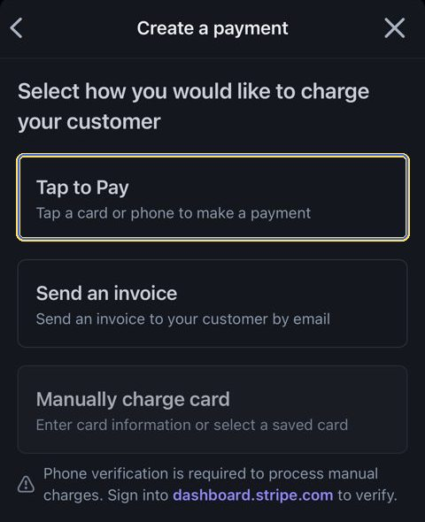 |
| 1. **+** → **Charge card or send invoice**. Type the amount from the door page's "Card at the door" line, and the buyer's name as the **Description**. | 2. **Tap to Pay**, **Next**. The buyer holds their card or phone to the top edge of the iPhone until it confirms. |

The name matters: it travels with the payment and is filled in for you on
the site.

### Link the payment to a person

Within a few seconds the payment reaches the site (Stripe's
`payment_intent.succeeded` webhook). On the door page it waits in **Card
at the door** until someone says who it was: the amount in full size, how
long ago it was taken, the last six characters of Stripe's id, and what
that amount is the price of. The name from the app's description is filled
in, the ticket or item at that price is pre-picked, and the quantity only
appears for a shop item.

**One tap, several things.** A payment can pay for more than one thing —
an entry and a patch, two entries for two people, three sticker sheets and
a hoodie. Every line has what it was and how many: **every price is its own
choice in the list**, the members' price included, so a member's entry at
the door is picked, not typed. **Add a line** gives the payment another
line, and a further ticket line asks for that person's name. A count of two
on one ticket line is two tickets, the extras named after the payer (`Leo
H`, `Leo H +1`), for the friend whose name nobody wrote down. The line
total is shown against what was charged, so a mistyped count is visible
before anything is attached. Attaching makes a door ticket per ticket
(each checked in, named) and one paid purchase holding the item lines,
handed over on the spot; both hang off the same payment. Without
JavaScript the form keeps its single line, which is the everyday case.

The money is the last word: a payment for a single ticket or piece is
worth the whole payment, whatever the list says (an odd amount the board
typed by hand included). With several,
each line is worth the price picked, and whatever they miss the payment by
lands on the first line — so tickets plus items always add up to what
Stripe took (`attachDoorPayment` in `src/lib/purchases.ts`, the form read
by `doorLines` in `src/lib/door.ts`). The same unattached payment shows on every event's
door page opened within twelve hours and under "Selling on the spot" on
lahtiag.fi/shop/orders — attaching decides what it becomes, so attach a
ticket on the door page of the event it was taken at. lahtiag.fi/board
says how many are waiting. Once attached it disappears everywhere.

Both places render `src/components/TapPayments.astro`; the door page
passes the event's ticket types as well as the shop's items, the orders
page only the items.

| | |
|---|---|
| 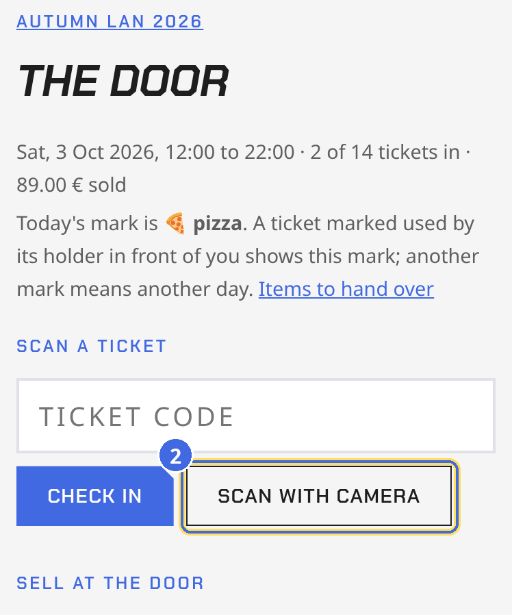 | 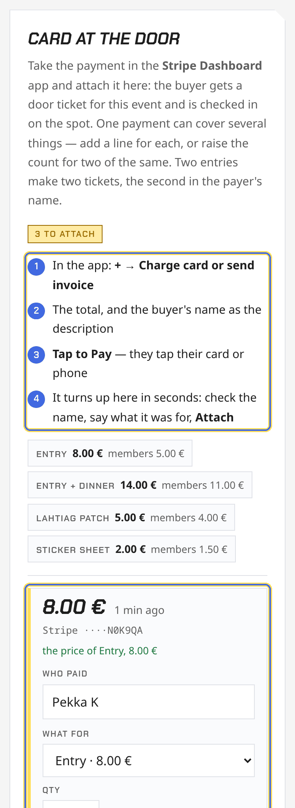 |
| The door page: the mark of the day, scan or type a code; the sales QRs follow below. | "Card at the door": the steps in the Stripe app, the prices to charge, then each waiting payment — the name pre-filled from the app's description, the ticket pre-picked when the amount matches a price, and what the amount matched said under it. Press **Attach**. |

| | |
|---|---|
| 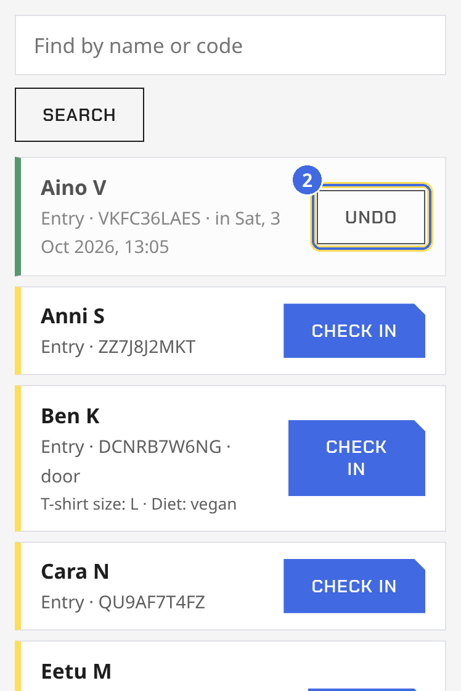 | 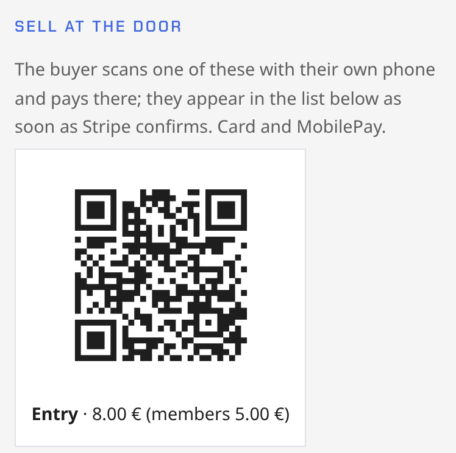 |
| The list: a person attached this way holds a paid ticket marked *door*, already checked in (green). Undo is there if it was the wrong one. | The sales QR per ticket type, for buyers with their own phone. |

### Buyers with their own phone

Faster for everyone: the door page shows a sales QR per ticket type. The
buyer scans it, lands on the checkout on their own phone, types their name
and pays with Apple Pay, MobilePay or a card. They appear in the door
list as soon as Stripe confirms, and their ticket link is on Stripe's page
and the receipt. Nothing to attach.

### Shop items on the spot

The same two ways work for patches and other shop items. With their own
phone, the buyer scans the **Shop** QR on the door page, buys on the shop
page and presses **Mark as collected** on their purchase page in front of
you (the mark of the day shows it is live). Without one, take the card in
the Stripe app as above; the payment appears under "Tap payments to
attach" on the door page **and** on the hand-over list (`/shop/orders`),
so a stand without an event works too. Pick the item and the quantity,
press Attach, and it is sold and marked handed over in one go, with the
amount that was tapped. Stock goes down; the buyer gets no link, they
have the item.

## The Minecraft whitelist

The site keeps the Minecraft server's whitelist, and the server pulls it.
A current member puts their own Java edition name on the list and can
bring two friends along on their membership, on the membership page
(lahtiag.fi/membership, "Minecraft server") or in Discord with
`/whitelist me <name>`, `/whitelist friend <name>`, `/whitelist remove
<name>` and `/whitelist list`. The board adds any name with `/whitelist
add <name>` and takes any name off with `/whitelist drop <name>`. A
member whose status in the register turns to former loses their names on
the next pull, board names stay. A name can be on the list once, in any
letter case.

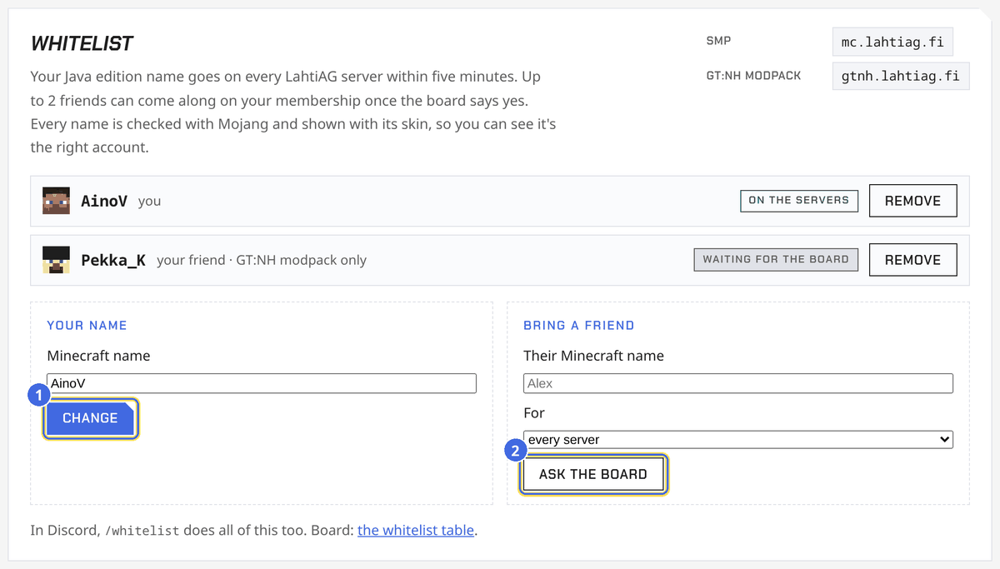

*The membership page's Minecraft tab: names with the skin's face, 1 Change, 2 Ask the board for a friend.*

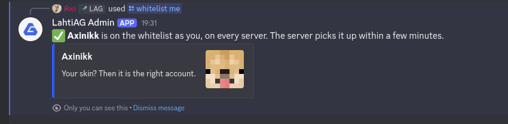

*The bot's answer to `/whitelist me`, with the skin, visible to that person only.*

A friend is an application: it sits at the top of lahtiag.fi/whitelist,
in "Waiting for a decision", and in the board channel as a line with
Approve and Decline buttons (the bot posts it, since a webhook cannot
carry buttons; without the bot the webhook posts it without them). Any
board member decides, on the buttons, with `/whitelist approve <name>` or
`/whitelist decline <name>`, or on the page; the member gets a DM. The
name reaches the servers only once approved. Actives requests from the
membership page arrive the same way, and approving one gives the Actives
role right there.

The page itself is four numbers (on the servers, waiting, friends, board
names), then the cards: what waits for a decision, the board names to
hand over while there are any, and everyone on the list. The list is a
table with the name and its skin, who it belongs to and as what, the
servers, the play time this season under that exact name, the status and
the day it was added, with **Drop** on every row. A search and the
filters above it (all, members' own, friends, board names, waiting, off
the servers) are `?q=` and `?view=` in the address, so a filtered list can
be linked to.

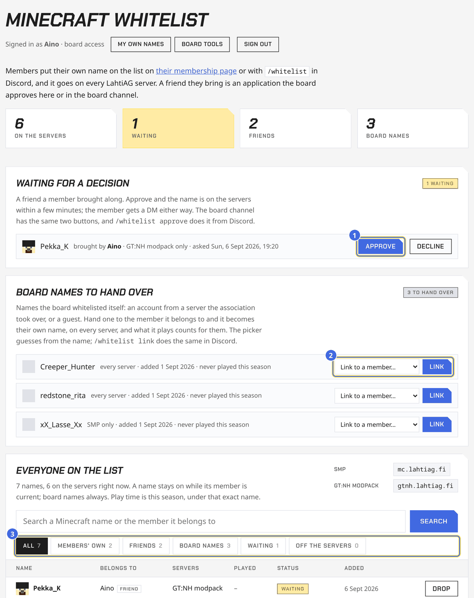

*lahtiag.fi/whitelist: 1 Approve or Decline a friend, 2 hand a board name over, 3 search and filter the list.*

Every name is checked with Mojang when it is saved: a name with no
account is refused, the exact spelling and the account's UUID are stored,
and the skin's face shows beside the name on the membership page and in
the bot's answer, so people can see it is their own account. The server
gets the UUIDs with the names, so a stopped server's file is written
without asking Mojang again. The faces come through
`/membership/minecraft/face/<uuid>` from a public skin renderer
(crafatar.com, mc-heads.net as the fallback), cached a day.

Every name is for every server (the SMP and the GT:NH modpack) unless
the person narrows it with the optional server choice on `/whitelist`;
the list of servers is `SERVERS` in `src/lib/minecraft.ts`, and adding a
server there plus a config file on the machine is all a new server needs.

The server side is `scripts/minecraft/whitelist-sync.py`, run every five
minutes per server by `lahtiag-whitelist@<server>.timer` on the machine
that runs AMP, each with its own `/etc/lahtiag-whitelist-<server>.conf`
(`SERVER=<slug>` in it). It fetches
`https://lahtiag.fi/api/minecraft/whitelist?server=<slug>` with the
`MINECRAFT_WHITELIST_TOKEN` secret as a bearer token and compares the
answer with the instance's own `whitelist.json`. A running server gets
`whitelist add` and `whitelist remove` console commands through the
instance's AMP API; a stopped or sleeping server, or one without AMP
credentials in the config, gets `whitelist.json` rewritten directly with
the UUIDs looked up at Mojang, which the server reads when it next
starts. A failed fetch changes nothing, names in `KEEP` are never
removed, and `REMOVE=no` makes it add-only. A name that is not a real
Mojang account is skipped and printed on each run.

The names that were on the server before the site took over were seeded
as board names, so nothing was removed on the first pull; a member who
whitelists the same name takes it over.

Editing a post: "Edit this post" under each post on the news page; a
published post's Discord message is rewritten with it.

Setting it up, once:

1. Make the token and hand it to the site, without it ever passing
   through a chat: on the server `openssl rand -hex 32 > /etc/lahtiag-whitelist.token && chmod 600 /etc/lahtiag-whitelist.token`,
   then from a laptop `ssh server cat /etc/lahtiag-whitelist.token | npx wrangler secret put MINECRAFT_WHITELIST_TOKEN`
   in the site's checkout.
2. In AMP, create a user (say `whitelist`) with console access to the
   Minecraft instance, nothing more. This is only needed to change a
   running server; leave the two lines empty until then and the script
   updates the file whenever the server is off. To fill them in without
   typing a password into a chat or a shell history, run
   `lahtiag-whitelist-setcreds` on the server as root (from
   `scripts/minecraft/`): it asks for the user and the password on the
   terminal and writes them into the config.
3. On the server: copy `scripts/minecraft/whitelist-sync.py` to
   `/usr/local/bin/lahtiag-whitelist-sync.py` (executable), the
   `lahtiag-whitelist@.service` and `.timer` to `/etc/systemd/system/`,
   and `lahtiag-whitelist.conf.example` to
   `/etc/lahtiag-whitelist-<server>.conf` for each server (mode 600) with
   the server's slug, the token, the AMP user and password, the
   instance's AMP address and its `whitelist.json` path filled in.
4. `systemctl daemon-reload && systemctl enable --now lahtiag-whitelist@smp.timer`
   (and `@gtnh`), then `journalctl -u lahtiag-whitelist@smp` shows each
   run ("in sync: 12 names", or what it sent).

Without the secret the API answers 404 and nothing on the site changes;
the membership page and the command still take names, ready for when the
server starts pulling.

**Linking the old names.** The names seeded from the server's own list
are board names, which belong to nobody, so their play time counts for no
member until the name is theirs. Besides the member claiming it with
`/whitelist me`, the board links it: in "Board names to hand over" on
lahtiag.fi/whitelist, one picker per name (it offers current members
without an own name, the likely one preselected by resemblance to their
Discord name; **Link** on a board name's table row jumps to it), or with
`/whitelist link <name> @member`
(`linkBoardName` in `src/lib/minecraft.ts`). The row becomes the member's
own name on every server, the member gets a DM, the board channel a line.

**The season so far.** `src/lib/season.ts` adds a member's season up:
events attended (going or a paid ticket, started, since 1 September),
Discord messages and voice, Minecraft play time under their own name, for
the membership page and the `/season` command in Discord. Both say
plainly when no Minecraft name is linked to the member, since play under
a name that isn't theirs counts for nobody. The pass's XP and levels will
be computed from the same numbers once the board has set the rules.

**The board's season page.** `/board/season` (`src/pages/board/season.astro`,
open to the Board role and the register accounts alike through
`requireAnyBoard` in `src/lib/board-access.ts`) shows what has been
counted, nobody named: the totals, the same by week (Mondays,
`src/lib/season-stats.ts`), by channel, Minecraft by server, and how many
of the people counted are linked members. It is the check that the
counting is right before any rule of the pass hangs on it. One season at
a time, the current one unless `?season=2025` asks for a past one; the
seasons on offer are the academic years with anything counted, and last
season never blends into this one. `/board` is the hub with every board
page, the same one a board member without register access sees at
`/register`. Both prefixes are in `run_worker_first` in `wrangler.toml`
(both environments), like every server route.

**Ticks.** What the board notes by hand for the season pass, because
nothing can count it: helping at an event, and whatever else the board
adds to the list on the season page (`tick_kinds`; a retired kind leaves
the give list and keeps its ticks). A tick (`ticks`, `src/lib/ticks.ts`)
is one kind given to one register entry by a board member, optionally for
one event, the same kind once per event; ticks go to current members only
and follow the entry (a Discord relink keeps them, erasing the entry
deletes them, deleting the event keeps the tick without the event). Given
on the season page or under an event's Participants, both through
`POST /board/ticks`; every tick given is a line in the board channel. A
member sees their own under `/season` and on the membership page, this
season's only: everything is cut at 1 September (`seasonRange`), so last
season's ticks never count in this one. A kind carries what a tick is
worth (`xp`), how many of them count per member (`season_cap`, 0 = every
one) and the period that cap counts in (`period`: season, month or
week, judged by when the tick was given, Helsinki time); a tick keeps
the XP it was given with (`ticks.xp`), and saving a kind rewrites the
current season's ticks of that kind to the new XP, so a changed number
reaches everyone this season while past seasons keep what they were
paid. The counting is on the pass side: giving is never refused
for a cap; `applyCaps` walks a member's ticks oldest first, groups them
by kind and period bucket (`periodKey`), and flags the ones past the cap
as noted, not paid; `tickXp` adds the rest up, and the season page shows
the flag in brackets (`markCounted`). Nothing is stored per period and
nothing resets, the same way the monthly voice and Minecraft rules will
read the per-day counts. The first kind holds the board's outline: 100
XP, once a season.

**Claims.** A kind the board marks claimable on the season page can be
asked for by a member: `/claim` in Discord (or the Claim a tick button
under `/season` and the leaderboard) walks them through the kind, the
event if any, and a note in a modal; `src/lib/claims.ts` stores the
claim (`tick_claims`, one pending claim per kind, member and event, and
none where the tick is already given) and posts a line with Approve and
Decline to the board channel (`approveButtons('c', id)`, handled in
`handleBoardButton` like a friend request). The season page lists the
same claims under "Claims waiting for a decision" for the board without
Discord at hand; deciding in either place gives the tick through
`giveTick` (so the once-per-event rule and the caps apply as usual, and
a claim whose tick was meanwhile given by hand stays pending with a
warning) and DMs the member (`claimDecisionDm`). Claims need a current
membership with the Discord account linked; `/season` and the membership
page say how many of the member's claims are waiting.

**The XP leaderboard.** `/leaderboard` posts the season's top ten by XP
for everyone to see, as an embed in the brand blue with a monospace
table in it (`src/lib/xp.ts`: `xpStandings` adds every linked member's
ticks up with the caps, `leaderboardEmbed` draws it, with the reader's
own rank under the table when they are not in it). Names in the table
are the cached Discord names (`members.username`, refreshed whenever
someone uses the season commands), else the handle on the register
entry, since mentions don't render inside a code block. XP is the ticks
until the board sets the rules; events, Discord activity and Minecraft
play join in the same function then. Members hidden from the history
page's leaderboard are hidden here too, and their numbers never appear
in the public message. The message carries buttons that answer privately to whoever
presses them, on the public message as well: My season (the `/season`
reply), Claim a tick, Link my Minecraft name (a modal that does what
`/whitelist me` does), and a link to the membership page; the same
buttons sit under `/season`. Custom ids start with `s:`; the modals with
`s:modal:`. Both commands are registered with
`scripts/register-commands.mjs` like the others. The season pass's
first reward, a participant role, is picked on the register's Discord
roles section like the champion role (settings key
`participant_role_id`) and waits there for the rules: nothing gives it
yet.

**Play time.** For the season pass, `scripts/minecraft/playtime-sync.py`
(installed as `/usr/local/bin/lahtiag-playtime-sync.py`, run by
`lahtiag-playtime@smp.timer` and `@gtnh.timer` every five minutes, same
config files as the whitelist sync) reads each server's own player
statistics, the online ticks per player in `<world>/stats/<uuid>.json`
(the SMP's Fabric world keeps them under `<world>/players/stats`; the
1.7.10 modpack's are the flat `stat.playOneMinute` form), and posts the
minutes since the last run per player and day to
`/api/minecraft/playtime` with the whitelist token, as numbered batches
applied once (`src/lib/playtime.ts`; tables `minecraft_playtime` and
`minecraft_playtime_batches`). The first run only takes a baseline, so
play before the script existed is not counted; the state, the last ticks
per player and the unsent minutes, is `/var/lib/lahtiag-playtime-<server>.json`.
A member's time is the rows for their own names' UUIDs, shown on the
membership page as "Minecraft this season". The stats files are written
on the server's autosave and when a player leaves, so minutes arrive in
lumps a few minutes late. `STATS_DIR=` in the config file overrides the
detection.

## The Discord activity listener

For the season pass (the academic-year rewards the board is planning), the
site counts, per member and day, the messages sent and the minutes spent
in voice on the LahtiAG server, and the same per channel and day for
statistics. Counts only, never a word of content, and the privacy page
says so. A member sees their own season on the membership page. Per day
is what makes weekly and monthly rules, streaks and "active days" possible
later: a monthly rule looks at each month's sum, nothing ever resets, and
the season is the sum of it all.

**How it counts.** A small always-on process on auraserver
(`scripts/discord-listener/listener.mjs`; container `lahtiag-listener` in
`/opt/lahtiag-listener`; plain Node, no dependencies) signs in with the bot
token. Messages it walks over the REST API a hundred at a time from a
cursor per channel (text and announcement channels, voice channels' chats,
open threads), so an outage or a restart loses nothing and the first run
backfills the season from 1 September; bots and slash commands don't
count. Voice it watches live on the gateway, crediting a minute at a time;
the AFK channel doesn't count. Every minute it posts what it has to
`https://lahtiag.fi/api/discord/activity` with the `DISCORD_ACTIVITY_TOKEN`
secret, as a batch numbered per listener instance, and the site applies
each batch once (a retry answers `duplicate: true`) and keeps the receipts
a month (`src/lib/activity.ts`; tables `discord_activity` per member and
day, `discord_channel_activity` per channel and day with a thread counted
for its channel, and `discord_activity_batches`). The listener's own state, the cursors and the
unsent counts, lives in `/opt/lahtiag-listener/state/state.json`.

**Which channels count.** Only the channels every member can see: those
the @everyone role can view, or that the Member role (`MEMBER_ROLE_ID` in
`.env`, the same id as on the register's Discord roles section) is allowed
to view, the open threads inside them, and the chats of such voice
channels; voice minutes likewise only in voice channels every member can
see. So the board channel, the actives channel, an event's channels and
team voice channels never count. `COUNT_CHANNELS=all` in `.env` turns the
filter off. The listener logs "counting in …" whenever the set changes
(`docker logs lahtiag-listener`) and sends the list with every batch, kept
in the settings table under `activity_channels`; the site shows members
the rule, not the list.

**Setting it up** (done 2026-09-06): the files from
`scripts/discord-listener` in `/opt/lahtiag-listener`, and `.env` there
(mode 600) with `DISCORD_GUILD_ID`, `ACTIVITY_URL`, `ACTIVITY_TOKEN`
(generated on the server; the same value is the site's secret),
`MEMBER_ROLE_ID`, and the bot
token, which `lahtiag-listener-setcreds` asks for on the terminal and then
starts the container. The bot needs View Channel and Read Message History
in the channels that should count (its invite has both); no privileged
intent is involved. `docker logs -f lahtiag-listener` shows what it counts
and pushes; "the gateway refused the token or the intents" means the token
is wrong. To recount a season from scratch: stop the container, delete
`state/state.json` and the rows in `discord_activity`,
`discord_channel_activity` and `discord_activity_batches`, then
`docker compose up -d --force-recreate`.

## Editing this handbook

This file is the technical handbook. The board reads it rendered at
[lahtiag.fi/handbook/technical](https://lahtiag.fi/handbook/technical)
(Board role or register login) and on GitHub; the short, plain
[board guide](BOARD-GUIDE.md) is at lahtiag.fi/handbook. Pictures go in `docs/images/…`; the site
serves a copy from `public/handbook/images`, so after adding or changing
one, run `cp -r docs/images public/handbook/` before pushing.

### Regenerating the pictures

The screenshots in `docs/images/site` come from a local copy of the site
filled with made-up people, never from the live database. From the
repository root:

1. Put throwaway values in `.dev.vars`: `SESSION_SECRET=local-dev-only-session-secret-not-used-anywhere-else`
   (the one `scripts/handbook/mint.mjs` seals cookies with), any
   `GOOGLE_CLIENT_ID` and `GOOGLE_CLIENT_SECRET`, `STRIPE_SECRET_KEY=sk_test_x`,
   `STRIPE_WEBHOOK_SECRET=whsec_x`, and
   `REGISTER_ADMINS=puheenjohtaja@lahtiag.fi,rahastonhoitaja@lahtiag.fi` so
   no real address ends up in a picture.
2. `npx wrangler d1 migrations apply lahtiag --local`, then
   `python3 scripts/handbook/seed.py` (needs Pillow) fills the local
   database with the sample events, members, tickets, news and shop.
3. `npm run build && npx wrangler dev --port 8788` in another terminal; it
   serves the built site, so rebuild after changing a page.
4. `npm i --no-save playwright-core`, `node scripts/handbook/mint.mjs`
   (the cookies), `python3 scripts/handbook/plan.py` (the shot list),
   `node scripts/handbook/shoot.mjs scripts/handbook/shots.json scripts/handbook/shots`
   (a comma-separated list of names as a fourth argument retakes only
   those), then `python3 scripts/handbook/post.py scripts/handbook/jobs.json`
   crops, highlights and shrinks them into `docs/images/site`.
5. `cp -r docs/images public/handbook/` and push.

`plan.py` is the list of pictures: the page, who is signed in, what to
crop to and what to highlight (a numbered badge per highlight, in the
order given). The Stripe app pictures are phone screenshots cropped by
`scripts/handbook/app-jobs.json`; `sheet.py` makes contact sheets for a
quick look at the result.

## Editing the site's pages

Add or edit Markdown in `src/content/pages/`, push to `main`, done. A page
`<name>.md` is served at `/<name>`. Frontmatter: `title` (required),
`description`, and `navOrder` (leave out to keep the page off the nav).
Two reserved names: `home.md` is the front page, and `history.md` is only
the intro of the history page, which is otherwise built from the database:
the Hall of Fame, the leaderboard, and a tile per past event with its
cover or first photo, its champion and its pictures. Files must sit directly in the folder —
no subdirectories.

## The moving parts

| Thing | Where |
|---|---|
| Worker + assets + routes + vars | `wrangler.toml` (root); preview env repeats EVERYTHING — named environments inherit nothing |
| Database schema | `migrations/`, forward-only, applied **manually**: `npx wrangler d1 migrations apply lahtiag --remote` (and `lahtiag-preview --env preview`) — CI never touches the database |
| All SQL | `src/lib/db.ts`, one function per operation; routes and bot handlers never contain SQL |
| The board's season page and the ticks | `src/pages/board/`, `src/lib/season-stats.ts`, `src/lib/ticks.ts`; the counting itself in `src/lib/activity.ts` and `src/lib/playtime.ts` |
| Member register | `migrations/0006_register.sql`; form choices + validation in `src/lib/register.ts`; pages under `src/pages/register/` and `src/pages/join.astro`; import script `scripts/import-register.mjs` |
| Register sign-in (Google) | `src/lib/board.ts` (board cookie, allowlist, `requireBoard`), `src/lib/google.ts` (OAuth calls), routes `src/pages/auth/google*`; fixed allowlist `REGISTER_ADMINS` in `wrangler.toml`, the rest in the `register_admins` table |
| Auth (cookies, CSRF) | `src/lib/auth.ts`, `src/lib/guard.ts` — stateless HMAC-signed session cookie, 24 h |
| Discord API calls | `src/lib/discord.ts` (server side); `src/lib/discord-widget.ts` is the browser widget's and stays separate |
| The bot | `src/pages/discord/interactions.ts` — HTTP Interactions, Ed25519-verified, no bot token exists anywhere |
| Slash-command definitions | `scripts/register-commands.mjs` — run after changing commands: `DISCORD_CLIENT_ID=… DISCORD_CLIENT_SECRET=… node scripts/register-commands.mjs` |
| Security headers | `public/_headers` (static assets) **and** `src/middleware.ts` (Worker responses) — keep the two CSPs identical |
| Helsinki time handling | `src/lib/time.ts` — storage is UTC unix seconds, always |
| Brand assets | `public/brand/`; the Canva kit is the source of truth (blue #4169e1, yellow #ffde59, ink #1e1e1e, Chakra Petch ≈ the wordmark) |
| Minecraft play time | `scripts/minecraft/playtime-sync.py` + `lahtiag-playtime@.service/.timer` on auraserver; API `src/pages/api/minecraft/playtime.ts`; `src/lib/playtime.ts` |
| The Discord activity listener | `scripts/discord-listener/` (listener.mjs, compose.yaml, setcreds); on auraserver as container `lahtiag-listener` in `/opt/lahtiag-listener`; API `src/pages/api/discord/activity.ts`, counting `src/lib/activity.ts` |

Secrets (set with `npx wrangler secret put NAME`, never committed):
`SESSION_SECRET`, `DISCORD_CLIENT_ID`, `DISCORD_CLIENT_SECRET`,
`DISCORD_PUBLIC_KEY`, `DISCORD_WEBHOOK_URL`, `GOOGLE_CLIENT_ID`,
`GOOGLE_CLIENT_SECRET` (the register sign-in), the optional
`BOARD_WEBHOOK_URL` (a webhook into a board-only channel; membership
applications are announced there by name and school), the optional
`WELCOME_WEBHOOK_URL` (a public channel; an approved member is welcomed
there by mention or handle, never by name), and the optional
`DISCORD_BOT_TOKEN` (roles only; with `MEMBER_ROLE_ID` / `ACTIVES_ROLE_ID`
in `wrangler.toml`). The Discord application lives
in the [developer portal](https://discord.com/developers/applications) under
the association's account; its custom emojis (`lag_*`, used by the panel
buttons) live in the app's Emojis tab.
Two more secrets are bearer tokens for machines: `MINECRAFT_WHITELIST_TOKEN`
for the whitelist sync and `DISCORD_ACTIVITY_TOKEN` for the activity
listener; their sections say where the other half of each lives.

## Local development

```bash
git clone git@github.com:Valtterios/lahtiag-site.git && cd lahtiag-site
npm install        # approve the esbuild/workerd install scripts if asked
npm test           # the whole suite runs inside the real Workers runtime
npm run check      # type-checks .astro files
npm run build
npx wrangler deploy --dry-run   # binding list should be exactly ASSETS + DB + ADMIN_ROLE_ID
```

Node 24 is pinned in `.nvmrc`. `astro dev` daemonizes (`astro dev stop` to
kill it). Deploying by hand (`npx wrangler deploy`) needs `npx wrangler
login` with the lahtiagry account; pushing to `main` needs no credentials
at all and is the normal path.

## Things that will bite you

- **Server routes must be listed in `run_worker_first`** (`wrangler.toml`,
  both environments). Cloudflare's asset router answers browser navigations
  to unlisted non-asset paths with the 404 page without ever invoking the
  Worker — and curl won't catch it. Test new SSR routes with
  `curl -H 'Sec-Fetch-Mode: navigate'`.
- **CSP forbids inline scripts and styles.** `assetsInlineLimit: 0` and
  `inlineStylesheets: 'never'` in `astro.config.mjs` keep Astro from
  inlining; remove either and pages break silently.
- **Env access is `import { env } from 'cloudflare:workers'`** and the
  execution context is `Astro.locals.cfContext`. `Astro.locals.runtime.env`
  throws in this adapter version.
- **The Discord invite code is read live from widget.json on every page
  load** — never hardcode one, they expire.
- **The lahtiag.fi DNS zone carries the association's Google Workspace
  mail.** Never touch the MX or TXT records.
- **D1 has no undo** (Time Travel gives 30 days of point-in-time restore).
  Previews bind a separate database (`lahtiag-preview`) for exactly this
  reason.

## When something breaks

- **Discord widget stuck or erroring on the front page**: Discord server
  settings → Widget → confirm *Enable Server Widget* is on. That toggle is
  the only production failure mode it has.
- **Login errors** distinguish three cases on purpose: not in the Discord
  server (join first), Discord unreachable (wait, retry), stale attempt
  (just retry). "Discord didn't answer while re-checking your role" during
  rapid admin clicking is rate limiting — wait a few seconds, or use the
  Discord panel instead.
- **Site down?** Check Cloudflare's status and the Workers Builds tab for a
  failed deploy; a failed build never replaces the running version. Logs:
  Workers & Pages → lahtiag-site → Logs.
- **Bad deploy**: `git revert` the offending commit and push — the build
  pipeline redeploys the previous behaviour in ~2 minutes.
